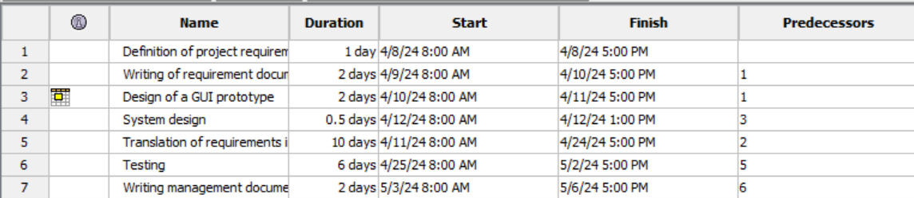
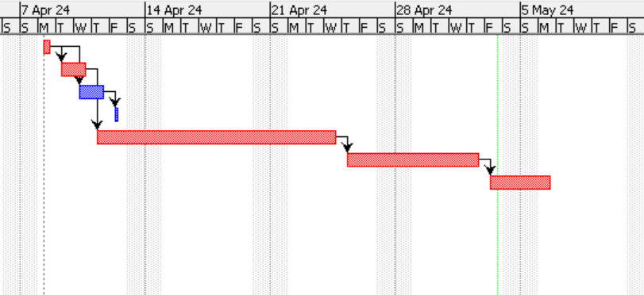

# Project Estimation - CURRENT
Date: 30/4/2024

Version: V1

# Estimation approach
Consider the EZElectronics  project in CURRENT version (as given by the teachers), assume that you are going to develop the project INDEPENDENT of the deadlines of the course, and from scratch
# Estimate by size
### 
|             | Estimate                        |             
| ----------- | ------------------------------- |  
| NC =  Estimated number of classes to be developed   |                 21            |             
|  A = Estimated average size per class, in LOC       |                 300           | 
| S = Estimated size of project, in LOC (= NC * A) |6300|
| E = Estimated effort, in person hours (here use productivity 10 LOC per person hour)  |                 630                     |   
| C = Estimated cost, in euro (here use 1 person hour cost = 30 euro) |18900| 
| Estimated calendar time, in calendar weeks (Assume team of 4 people, 8 hours per day, 5 days per week ) |        4 weeks         |               
_We have considered a "class" as an instance of a JavaScript Class_
# Estimate by product decomposition
### 
|         component name    | Estimated effort (person hours)   |             
| ----------- | ------------------------------- | 
|requirement document    |80 |
| GUI prototype |50|
|design document |35|
|code |300|
| unit tests |60|
| api tests |60|
| management documents  |40|

# Estimate by activity decomposition
### 
|         Activity name    | Estimated effort (person hours)   |             
| ----------- | ------------------------------- | 
|Definition of project requirements| 8|
|Writing of proget requirements| 60|
|Design of GUI prototype| 60|
|System design | 20|
|Translation of requirements in code| 270|
|Testing (unit and API) | 100|
|Writing Management Document|45|

###

# Summary

Report here the results of the three estimation approaches. The  estimates may differ. Discuss here the possible reasons for the difference

|                                    | Estimated effort | Estimated duration |     |
| ---------------------------------- | ---------------- | ------------------ | --- |
| estimate by size                   | 630              | 4 weeks            |     |
| estimate by product decomposition  | 625              | 4 weeks and 1 day |     |
| estimate by activity decomposition | 613              | 4 weeks   |     |

