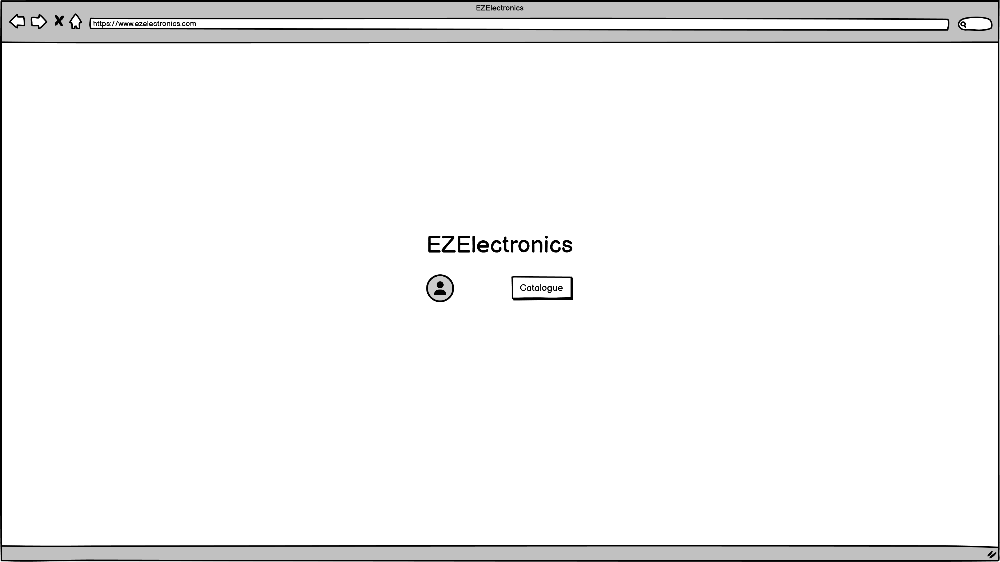
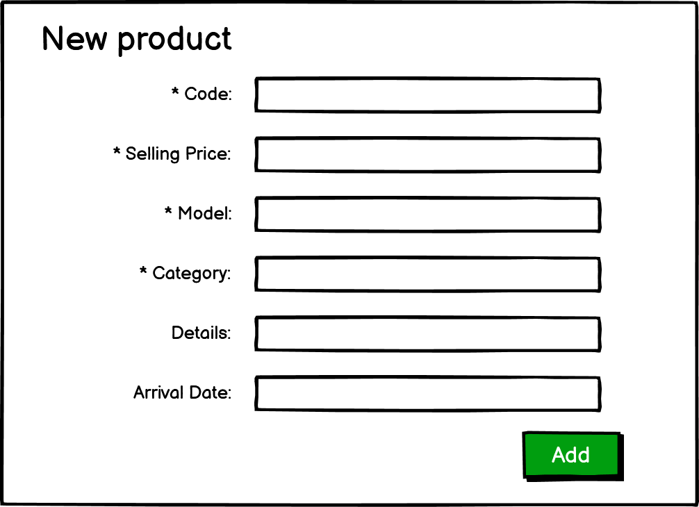

# Graphical User Interface Prototype - CURRENT

Authors: Emanuele Montanaro 

Date:   28/4/2024

Version:    V1

<!-- \<Report here the GUI that you propose for EZElectronics in CURRENT form, as received by teachers. You are free to organize it as you prefer. A suggested presentation matches the Use cases and scenarios defined in the Requirement document. The GUI_V01 can be shown as a sequence of graphical files (jpg, png) > -->

# Customer home page

# Manager home page

# Welcome page

# Carts history

# Carts

# Mark a product as sold

# Register new product

# Customer products interface

# Manager products interface

# New arrival

# Search by category

# Search by model

# Profile page

# Login page

# Manage users
