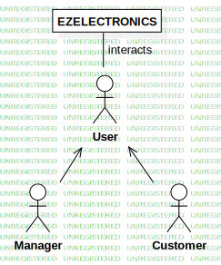
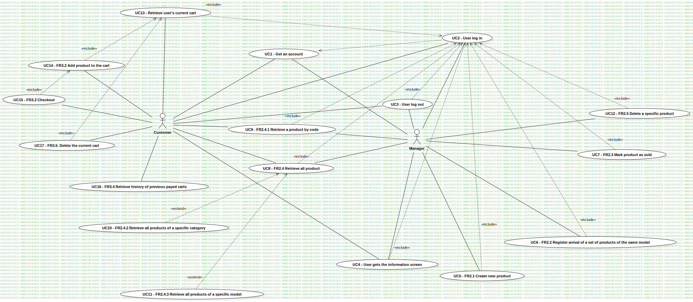
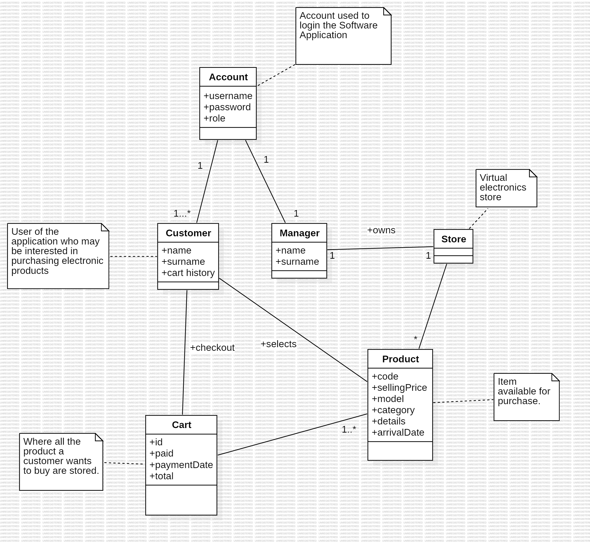
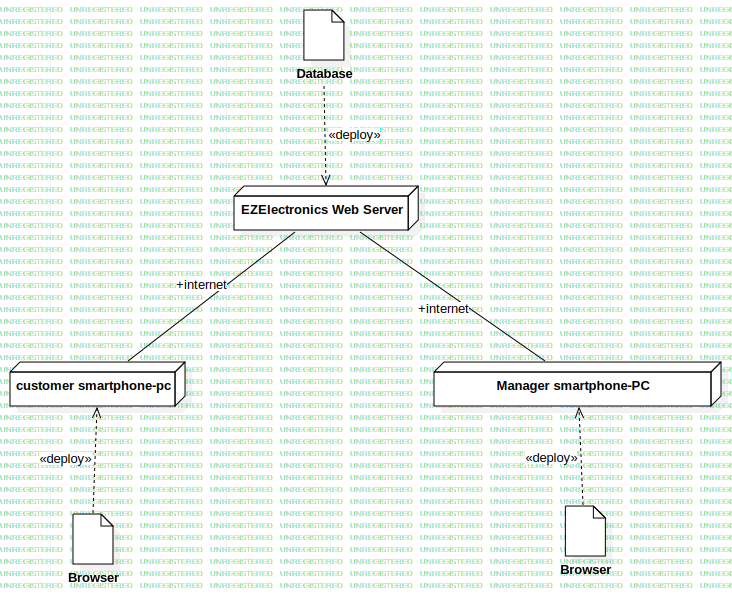

# Requirements Document - current EZElectronics

Date:

Version: V1 - description of EZElectronics in CURRENT form (as received by teachers)

| Version number | Change |
| :------------: | :----: |
|                |        |

# Contents

- [Requirements Document - current EZElectronics](#requirements-document---current-ezelectronics)
- [Contents](#contents)
- [Informal description](#informal-description)
- [Stakeholders](#stakeholders)
- [Context Diagram and interfaces](#context-diagram-and-interfaces)
  - [Context Diagram](#context-diagram)
  - [Interfaces](#interfaces)
- [Stories and personas](#stories-and-personas)
- [Functional and non functional requirements](#functional-and-non-functional-requirements)
  - [Functional Requirements](#functional-requirements)
  - [Non Functional Requirements](#non-functional-requirements)
- [Use case diagram and use cases](#use-case-diagram-and-use-cases)
  - [Use case diagram](#use-case-diagram)
    - [Use case 1, UC1](#use-case-1-uc1)
      - [Scenario 1.1](#scenario-11)
      - [Scenario 1.2](#scenario-12)
      - [Scenario 1.3](#scenario-13)
    - [Use case 2, UC2](#use-case-2-uc2)
      - [Scenario 2.1](#scenario-21)
      - [Scenario 2.2](#scenario-22)
      - [Scenario 2.3](#scenario-23)
      - [Scenario 2.4](#scenario-24)
    - [Use case 3, UC3](#use-case-3-uc3)
      - [Scenario 3.1](#scenario-31)
    - [Use case 4, UC4](#use-case-4-uc4)
      - [Scenario 4.1](#scenario-41)
    - [Use case 5, UC5](#use-case-5-uc5)
      - [Scenario 5.1](#scenario-51)
      - [Scenario 5.2](#scenario-52)
      - [Scenario 5.3](#scenario-53)
      - [Scenario 5.4](#scenario-54)
      - [Scenario 5.5](#scenario-55)
      - [Scenario 5.6](#scenario-56)
      - [Scenario 5.7](#scenario-57)
    - [Use case 6, UC6](#use-case-6-uc6)
      - [Scenario 6.1](#scenario-61)
      - [Scenario 6.2](#scenario-62)
      - [Scenario 6.3](#scenario-63)
      - [Scenario 6.4](#scenario-64)
      - [Scenario 6.5](#scenario-65)
      - [Scenario 6.6](#scenario-66)
      - [Scenario 6.7](#scenario-67)
    - [Use case 7, UC7](#use-case-7-uc7)
      - [Scenario 7.1](#scenario-71)
      - [Scenario 7.2](#scenario-72)
      - [Scenario 7.3](#scenario-73)
      - [Scenario 7.4](#scenario-74)
      - [Scenario 7.5](#scenario-75)
      - [Scenario 7.6](#scenario-76)
      - [Scenario 7.7](#scenario-77)
      - [Scenario 7.8](#scenario-78)
    - [Use case 8, UC8](#use-case-8-uc8)
      - [Scenario 8.1](#scenario-81)
      - [Scenario 8.2](#scenario-82)
    - [Use case 9, UC9](#use-case-9-uc9)
      - [Scenario 9.1](#scenario-91)
      - [Scenario 9.2](#scenario-92)
      - [Scenario 9.3](#scenario-93)
    - [Use case 10, UC10](#use-case-10-uc10)
      - [Scenario 10.1](#scenario-101)
      - [Scenario 10.2](#scenario-102)
      - [Scenario 10.3](#scenario-103)
    - [Use case 11, UC11](#use-case-11-uc11)
      - [Scenario 11.1](#scenario-111)
      - [Scenario 11.2](#scenario-112)
      - [Scenario 11.3](#scenario-113)
    - [Use case 12, UC12](#use-case-12-uc12)
      - [Scenario 12.1](#scenario-121)
      - [Scenario 12.2](#scenario-122)
    - [Use case 13, UC13](#use-case-13-uc13)
      - [Scenario 13.1](#scenario-131)
    - [Use case 14, UC14](#use-case-14-uc14)
      - [Scenario 14.1](#scenario-141)
      - [Scenario 14.2](#scenario-142)
      - [Scenario 14.3](#scenario-143)
      - [Scenario 14.4](#scenario-144)
    - [Use case 15, UC15](#use-case-15-uc15)
      - [Scenario 15.1](#scenario-151)
      - [Scenario 15.2](#scenario-152)
    - [Use case 16, UC16](#use-case-16-uc16)
      - [Scenario 16.1](#scenario-161)
    - [Use case 17, UC17](#use-case-17-uc17)
      - [Scenario 17.1](#scenario-171)
      - [Scenario 17.2](#scenario-172)
      - [Scenario 17.3](#scenario-173)
      - [Scenario 17.4](#scenario-174)
      - [Scenario 17.5](#scenario-175)
- [Glossary](#glossary)
- [Deployment Diagram](#deployment-diagram)

# Informal description

EZElectronics (read EaSy Electronics) is a software application designed to help managers of electronics stores to manage their products and offer them to customers through a dedicated website. Managers can assess the available products, record new ones, and confirm purchases. Customers can see available products, add them to a cart and see the history of their past purchases.

# Stakeholders

| Stakeholder name |                                      Description                                       |
| :--------------: | :------------------------------------------------------------------------------------: |
|     Managers     |            Has to maintain accurate product information, restock inventory             |
|    Customers     | Who visit the website to browse products, add items to their cart, and make purchases. |

# Context Diagram and interfaces

## Context Diagram
<!-- \<Define here Context diagram using UML use case diagram> -->
<!-- \<actors are a subset of stakeholders> -->

## Interfaces

<!-- \<describe here each interface in the context diagram> -->
|   Actor   |       Logical Interface       |   Physical Interface   |
| :-------: | :---------------------------: | :--------------------: |
| Managers  | GUI Product Management System |      PC/internet       |
| Customers |      GUI, Web interface       | PC/Smartphone/internet |

<!-- \<GUIs will be described graphically in a separate document> -->

# Stories and personas

<!-- \<A Persona is a realistic impersonation of an actor. Define here a few personas and describe in plain text how a persona interacts with the system> -->
<!-- \<Persona is-an-instance-of actor> -->
<!-- \<stories will be formalized later as scenarios in use cases> -->
- Fabio is a customer. He heard about a platform where he can buy electronics. He connected to the dedicated website and want to create an account.
- Giorgio is the manager of a store whose website relies on EZElectronics. He has already set up his account and now he wants to log in to do some changes in the inventory.
- Antonella is the manager of a store. She wants to add a new set of products which arrived in storages. She needs an efficient and intuitive interface which allows to set the model, price, quantity, category, details and arrival date of the product.
- Alex is a customer and wants to check on the store catalogue. He needs a fast and responsive method which allows to view the desired information.
- Daniele is the manager of an electronic store. He wants to check information about iPhone 13s available in his store to see if a specific color is available. He needs an efficient interface to provide a list of products belonging to a given model.
- Morgan is the manager of an electronic store and its  catalogue is being renewed. To add all new products, he prefers to get rid of some obsolete products not to bring useless info in the new version of his store. He needs an efficient and safe way to delete products from the database.

# Functional and non functional requirements

## Functional Requirements

<!-- \<In the form DO SOMETHING, or VERB NOUN, describe high level capabilities of the system> -->

<!-- \<they match to high level use cases> -->

|   ID    |                       Description                       |
| :-----: | :-----------------------------------------------------: |
|   FR1   |                      Manage users                       |
|  FR1.1  | Allow login with valid credentials and performs logout  |
|  FR1.2  | Retrieve information about the currently logged in user |
|  FR1.3  |                     Create new user                     |
|  FR1.4  |             Retrieve the list of all users              |
| FR1.4.1 |                 Filter the list by role                 |
| FR1.4.2 |               Filter the list by username               |
|  FR1.5  |                       Delete user                       |
|   FR2   |                     Manage products                     |
|  FR2.1  |                   Create new product                    |
|  FR2.2  | Register arrival of a set of prodcuts of the same model |
|  FR2.3  |                      Mark as sold                       |
|  FR2.4  |                  Retrieve all products                  |
| FR2.4.1 |               Retrieve a product by code                |
| FR2.4.2 |              Retrieve products by category              |
| FR2.4.3 |               Retrieve products by model                |
|  FR2.5  |                Delete a specific product                |
|   FR3   |                       Manage cart                       |
|  FR3.1  |          Return the cart of the logged in user          |
|  FR3.2  |                 Add product to the cart                 |
|  FR3.3  |    Set total price and current date as payment date     |
|  FR3.4  |        Retrieve history of previous payed carts         |
|  FR3.5  |              Delete the whole current cart              |
| FR3.5.1 |          Remove a single product from the cart          |

## Non Functional Requirements

<!-- \<Describe constraints on functional requirements> -->

|  ID   | Type (efficiency, reliability, ..) |                                        Description                                        |      Refers to       |
| :---: | :--------------------------------: | :---------------------------------------------------------------------------------------: | :------------------: |
| NFR1  |             Usability              | should be able to use the software application with no training in less than 10 minutes.  |       Customer       |
| NFR2  |             Usability              |                    The training should not be longer than 30 minutes.                     |       Manager        |
| NFR3  |             Efficiency             | Software application should responds to user input in <0.5 s (excluding network latency). | Customer and Manager |
| NFR4  |      Reliability/availability      |                        No more than one defect per year per user.                         |        System        |
| NFR5  |            Portability             |               The site must be compatible with Chrome Version 120 or higher               |        System        |

# Use case diagram and use cases

## Use case diagram

<!-- \<define here UML Use case diagram UCD summarizing all use cases, and their relationships> -->

<!-- \<next describe here each use case in the UCD> -->
### Use case 1, UC1
User (customer or manager) get an account
| Actors Involved  |                               User                               |
| :--------------: | :--------------------------------------------------------------: |
|   Precondition   |                     User has not an account                      |
|  Post condition  |                                                                  |
| Nominal Scenario |                     1.1-User gets an account                     |
|     Variants     |                                                                  |
|    Exceptions    | 1.2-Account name already exist, 1.3-Password rules not satisfied |

#### Scenario 1.1

|  Scenario 1.1  |                                 Define an account                                 |
| :------------: | :-------------------------------------------------------------------------------: |
|  Precondition  |                                User has no account                                |
| Post condition |                              User has a new account                               |
|     Step#      |                                    Description                                    |
|       1        | [Actor] User fills in: name, surname, email, username, password and select a role |
|       2        |          [System]         Looks up for account name, it is not used yet           |
|       3        |                  [System] Check password constraints, satisfied                   |
|       4        |                       [System] Account created. Notify user                       |
|       5        |             [System] Returns code 201 "Account created with success".             |

#### Scenario 1.2

|  Scenario 1.2  |                                           Userame  already exists                                           |
| :------------: | :---------------------------------------------------------------------------------------------------------: |
|  Precondition  |                                             User has no account                                             |
| Post condition |                                           User has a new account                                            |
|     Step#      |                                                 Description                                                 |
|       1        |              [Actor] User fills in: name, surname, email, username, password and select a role              |
|       2        | [System]         Looks up for account name, it is already used. Returns error "409 username already exists" |
|       3        |                            [System] Send error message:"Username not available"                             |
|       4        |        [Actor] Repeat process until username available, then resume from point 3 in nominal scenario        |

#### Scenario 1.3

|  Scenario 1.3  |                                    Password does not satisfy requirements                                    |
| :------------: | :----------------------------------------------------------------------------------------------------------: |
|  Precondition  |                                             User has no account                                              |
| Post condition |                                            User has a new account                                            |
|     Step#      |                                                 Description                                                  |
|       1        |              [Actor] User fills in: name, surname, email, username, password and select a role               |
|       2        |                        [System]         Looks up for account name, it is not used yet                        |
|       3        | [System] Check password constraints, not satisfied. Return error "401 password does not satisfy constraints" |
|       4        |             [System] Send error message:"password does not satisfy constraints, insert a new one             |
|       5        |   [Actor] Repeat process until password satisfy requirements, then resume from strep 4 in nominal scenario   |

### Use case 2, UC2
User (customer or manager) log in
| Actors Involved  |                      User                       |
| :--------------: | :---------------------------------------------: |
|   Precondition   |               User has an account               |
|  Post condition  |                                                 |
| Nominal Scenario |               2.1-Customer log in               |
|     Variants     |               2.2-Manager log in                |
|    Exceptions    | 2.3- Username does not exist 2.4-Wrong password |
#### Scenario 2.1

|  Scenario 2.1  |                    Customer log in                    |
| :------------: | :---------------------------------------------------: |
|  Precondition  |                  User has an account                  |
| Post condition |                                                       |
|     Step#      |                      Description                      |
|       1        |       [Actor] User fills in: username, password       |
|       2        | [System]         Looks up for account name, it exists |
|       3        |        [System] Check password , it is correct        |
|       4        |                [System] Retrieve role                 |
|       5        |      [System] Grant access to the customer page       |
|       6        |                    [Actor] Log in                     |
|       7        |            [System] Returns "200 success".            |

#### Scenario 2.2

|  Scenario 2.2  |                    Manager log in                     |
| :------------: | :---------------------------------------------------: |
|  Precondition  |                  User has an account                  |
| Post condition |                                                       |
|     Step#      |                      Description                      |
|       1        |       [Actor] User fills in: username, password       |
|       2        | [System]         Looks up for account name, it exists |
|       3        |        [System] Check password , it is correct        |
|       4        |                [System] Retrieve role                 |
|       5        |       [System] Grant access to the manager page       |
|       6        |                    [Actor] Log in                     |
|       7        |            [System] Returns "200 success".            |

#### Scenario 2.3

|  Scenario 2.3  |                                           Username not found                                           |
| :------------: | :----------------------------------------------------------------------------------------------------: |
|  Precondition  |                                          User has an account                                           |
| Post condition |                                                                                                        |
|     Step#      |                                              Description                                               |
|       1        |                               [Actor] User fills in: username, password                                |
|       2        | [System]         Looks up for account name, it does not exists. Returns error "404 username not found" |
|       3        |                            [System] Send error message "Username not found"                            |
|       4        |        [Actor] Repeat process until usename exists, the resume from nominal or variant scenario        |

#### Scenario 2.4

|  Scenario 2.4  |                                                  Wrong password                                                  |
| :------------: | :--------------------------------------------------------------------------------------------------------------: |
|  Precondition  |                                               User has an account                                                |
| Post condition |                                                                                                                  |
|     Step#      |                                                   Description                                                    |
|       1        |                                    [Actor] User fills in: username, password                                     |
|       2        |                              [System]         Looks up for account name, it exists                               |
|       3        |              [System] Check password , it is not correct. Returns error "401 password not correct"               |
|       5        | [Actor] Repeat process until usename exists and password is correct, the resume from nominal or variant scenario |
### Use case 3, UC3
User (customer or manager) log out
| Actors Involved  |                  User                   |
| :--------------: | :-------------------------------------: |
|   Precondition   | User has an account and it is logged in |
|  Post condition  |                                         |
| Nominal Scenario |            3.1 User log out             |
|    Exceptions    |                                         |
#### Scenario 3.1

|  Scenario 3.1  |                   User log out                    |
| :------------: | :-----------------------------------------------: |
|  Precondition  |      User has an account and it is logged in      |
| Post condition |                                                   |
|     Step#      |                    Description                    |
|       1        |         [Actor] Click on the account icon         |
|       2        |             [Actor] Click on log out              |
|       3        | [System] Close current session, log out the user. |
|       4        |          [System] Returns '200 Success'.          |

### Use case 4, UC4
User (customer or manager) retrieve account information
| Actors Involved  |                  User                   |
| :--------------: | :-------------------------------------: |
|   Precondition   | User has an account and it is logged in |
|  Post condition  |    User gets the information screen     |
| Nominal Scenario |        4.1 User gets information        |
|    Exceptions    |                                         |
#### Scenario 4.1

|  Scenario 4.1  |          User gets information          |
| :------------: | :-------------------------------------: |
|  Precondition  | User has an account and it is logged in |
| Post condition |                                         |
|     Step#      |               Description               |
|       1        |    [Actor] Click on the account icon    |
|       2        |    [System] Load information screen.    |
|       3        |     [System] Returns '200 Success'.     |

### Use case 5, UC5

| Actors Involved  |                                                                                                           Manager                                                                                                            |
| :--------------: | :--------------------------------------------------------------------------------------------------------------------------------------------------------------------------------------------------------------------------: |
|   Precondition   |                                                                                   User is authenticated with a valid Manager role account                                                                                    |
|  Post condition  |                                                                                       A new product is available for customers to buy                                                                                        |
| Nominal Scenario |                                                                                               5.1 - Create new product - FR2.1                                                                                               |
|     Variants     |                                                                                                                                                                                                                              |
|    Exceptions    | 5.2 (mandatory field left empty), 5.3 (product code already exist), 5.4 (product category doesn’t exist), 5.5 (defined arrivalDate is after the current date), 5.6 (defined price is invalid), 5.7 (product code is invalid) |
#### Scenario 5.1

|  Scenario 5.1  |                                   Create new product                                   |
| :------------: | :------------------------------------------------------------------------------------: |
|  Precondition  |                User is authenticated with a valid Manager role account                 |
| Post condition |                    A new product is available for customers to buy                     |
|     Step#      |                                      Description                                       |
|       1        |                         [Actor] Clicks on “New Product" button                         |
|       2        | [System] Opens a form to be filled with information (mandatory fields are marked by *) |
|       3        |                                 [Actor] Fills the form                                 |
|       4        |                                [Actor] Commits the form                                |
|       5        |                              [System] Checks constraints                               |
|       6        |                              [System] Creates new product                              |
|       7        |    [System] Returns code 201 and a JSON with the code of the newly created product     |

#### Scenario 5.2

|  Scenario 5.2  |                               Mandatory field left empty                               |
| :------------: | :------------------------------------------------------------------------------------: |
|  Precondition  |                User is authenticated with a valid Manager role account                 |
| Post condition |                                 Product IS NOT created                                 |
|     Step#      |                                      Description                                       |
|       1        |                         [Actor] Clicks on “New Product" button                         |
|       2        | [System] Opens a form to be filled with information (mandatory fields are marked by *) |
|       3        |                                 [Actor] Fills the form                                 |
|       4        |                                [Actor] Commits the form                                |
|       5        |                              [System] Checks constraints                               |
|       6        |               [System] Returns ‘Error 400: mandatory fields left empty’                |

#### Scenario 5.3

|  Scenario 5.3  |                               Product code already exist                               |
| :------------: | :------------------------------------------------------------------------------------: |
|  Precondition  |                User is authenticated with a valid Manager role account                 |
| Post condition |                                 Product IS NOT created                                 |
|     Step#      |                                      Description                                       |
|       1        |                         [Actor] Clicks on “New Product" button                         |
|       2        | [System] Opens a form to be filled with information (mandatory fields are marked by *) |
|       3        |                                 [Actor] Fills the form                                 |
|       4        |                                [Actor] Commits the form                                |
|       5        |                              [System] Checks constraints                               |
|       6        |                  [System] Returns 'Error 409: product already exists'                  |

#### Scenario 5.4

|  Scenario 5.4  |                             Product category doesn’t exist                             |
| :------------: | :------------------------------------------------------------------------------------: |
|  Precondition  |                User is authenticated with a valid Manager role account                 |
| Post condition |                                 Product IS NOT created                                 |
|     Step#      |                                      Description                                       |
|       1        |                         [Actor] Clicks on “New Product" button                         |
|       2        | [System] Opens a form to be filled with information (mandatory fields are marked by *) |
|       3        |                                 [Actor] Fills the form                                 |
|       4        |                                [Actor] Commits the form                                |
|       5        |                              [System] Checks constraints                               |
|       6        |                  [System] Returns 'Error 400: category doesn’t exist'                  |

#### Scenario 5.5

|  Scenario 5.5  |                     Defined arrivalDate is after the current date                      |
| :------------: | :------------------------------------------------------------------------------------: |
|  Precondition  |                User is authenticated with a valid Manager role account                 |
| Post condition |                                 Product IS NOT created                                 |
|     Step#      |                                      Description                                       |
|       1        |                         [Actor] Clicks on “New Product" button                         |
|       2        | [System] Opens a form to be filled with information (mandatory fields are marked by *) |
|       3        |                                 [Actor] Fills the form                                 |
|       4        |                                [Actor] Commits the form                                |
|       5        |                              [System] Checks constraints                               |
|       6        |              [System] Returns 'Error 400: defined arrivalDate is invalid'              |

#### Scenario 5.6

|  Scenario 5.6  |                                Defined price is invalid                                |
| :------------: | :------------------------------------------------------------------------------------: |
|  Precondition  |                User is authenticated with a valid Manager role account                 |
| Post condition |                                 Product IS NOT created                                 |
|     Step#      |                                      Description                                       |
|       1        |                         [Actor] Clicks on “New Product" button                         |
|       2        | [System] Opens a form to be filled with information (mandatory fields are marked by *) |
|       3        |                                 [Actor] Fills the form                                 |
|       4        |                                [Actor] Commits the form                                |
|       5        |                              [System] Checks constraints                               |
|       6        |                    [System] Returns 'Error 400: price isn’t valid'                     |

#### Scenario 5.7

|  Scenario 5.7  |                                Product code is invalid                                 |
| :------------: | :------------------------------------------------------------------------------------: |
|  Precondition  |                User is authenticated with a valid Manager role account                 |
| Post condition |                                 Product IS NOT created                                 |
|     Step#      |                                      Description                                       |
|       1        |                         [Actor] Clicks on “New Product" button                         |
|       2        | [System] Opens a form to be filled with information (mandatory fields are marked by *) |
|       3        |                                 [Actor] Fills the form                                 |
|       4        |                                [Actor] Commits the form                                |
|       5        |                              [System] Checks constraints                               |
|       6        |         [System] Returns 'Error 400: code must be at least 6 characters long'          |

### Use case 6, UC6

| Actors Involved  |                                                                                                        Manager                                                                                                        |
| :--------------: | :-------------------------------------------------------------------------------------------------------------------------------------------------------------------------------------------------------------------: |
|   Precondition   |                                                                                User is authenticated with a valid Manager role account                                                                                |
|  Post condition  |                                                                                A new set of products is available for customers to buy                                                                                |
| Nominal Scenario |                                                                         6.1 - Register arrival of a set of products of the same model - FR2.2                                                                         |
|     Variants     |                                                                                                                                                                                                                       |
|    Exceptions    | 6.2 (mandatory field left empty), 6.3 (quantity is invalid), 6.4 (product category doesn’t exist), 6.5 (defined arrivalDate is after the current date), 6.6 (defined price is invalid), 6.7 (product code is invalid) |
#### Scenario 6.1

|  Scenario 6.1  |                Register arrival of a set of products of the same model                 |
| :------------: | :------------------------------------------------------------------------------------: |
|  Precondition  |                User is authenticated with a valid Manager role account                 |
| Post condition |                A new set of products is available for customers to buy                 |
|     Step#      |                                      Description                                       |
|       1        |                           [Actor] Clicks on “New Set” button                           |
|       2        | [System] Opens a form to be filled with information (mandatory fields are marked by *) |
|       3        |                                 [Actor] Fills the form                                 |
|       4        |                                [Actor] Commits the form                                |
|       5        |                              [System] Checks constraints                               |
|       6        |                             [System] Creates new products                              |
|       7        |                               [System] Returns code 201                                |
#### Scenario 6.2

|  Scenario 6.2  |                               Mandatory field left empty                               |
| :------------: | :------------------------------------------------------------------------------------: |
|  Precondition  |                User is authenticated with a valid Manager role account                 |
| Post condition |                              Products set IS NOT created                               |
|     Step#      |                                      Description                                       |
|       1        |                           [Actor] Clicks on “New Set” button                           |
|       2        | [System] Opens a form to be filled with information (mandatory fields are marked by *) |
|       3        |                                 [Actor] Fills the form                                 |
|       4        |                                [Actor] Commits the form                                |
|       5        |                              [System] Checks constraints                               |
|       6        |               [System] Returns ‘Error 400: mandatory fields left empty’                |

#### Scenario 6.3

|  Scenario 6.3  |                                  Quantity is invalid                                   |
| :------------: | :------------------------------------------------------------------------------------: |
|  Precondition  |                User is authenticated with a valid Manager role account                 |
| Post condition |                              Products set IS NOT created                               |
|     Step#      |                                      Description                                       |
|       1        |                           [Actor] Clicks on “New Set” button                           |
|       2        | [System] Opens a form to be filled with information (mandatory fields are marked by *) |
|       3        |                                 [Actor] Fills the form                                 |
|       4        |                                [Actor] Commits the form                                |
|       5        |                              [System] Checks constraints                               |
|       6        |                   [System] Returns ‘Error 400: quantity is invalid’                    |

#### Scenario 6.4

|  Scenario 6.4  |                             Product category doesn’t exist                             |
| :------------: | :------------------------------------------------------------------------------------: |
|  Precondition  |                User is authenticated with a valid Manager role account                 |
| Post condition |                              Products set IS NOT created                               |
|     Step#      |                                      Description                                       |
|       1        |                           [Actor] Clicks on “New Set” button                           |
|       2        | [System] Opens a form to be filled with information (mandatory fields are marked by *) |
|       3        |                                 [Actor] Fills the form                                 |
|       4        |                                [Actor] Commits the form                                |
|       5        |                              [System] Checks constraints                               |
|       6        |                  [System] Returns ‘Error 400: category doesn’t exist’                  |

#### Scenario 6.5

|  Scenario 6.5  |                     Defined arrivalDate is after the current date                      |
| :------------: | :------------------------------------------------------------------------------------: |
|  Precondition  |                User is authenticated with a valid Manager role account                 |
| Post condition |                              Products set IS NOT created                               |
|     Step#      |                                      Description                                       |
|       1        |                           [Actor] Clicks on “New Set” button                           |
|       2        | [System] Opens a form to be filled with information (mandatory fields are marked by *) |
|       3        |                                 [Actor] Fills the form                                 |
|       4        |                                [Actor] Commits the form                                |
|       5        |                              [System] Checks constraints                               |
|       6        |              [System] Returns ‘Error 400: defined arrivalDate is invalid’              |

#### Scenario 6.6

|  Scenario 6.6  |                                Defined price is invalid                                |
| :------------: | :------------------------------------------------------------------------------------: |
|  Precondition  |                User is authenticated with a valid Manager role account                 |
| Post condition |                              Products set IS NOT created                               |
|     Step#      |                                      Description                                       |
|       1        |                           [Actor] Clicks on “New Set” button                           |
|       2        | [System] Opens a form to be filled with information (mandatory fields are marked by *) |
|       3        |                                 [Actor] Fills the form                                 |
|       4        |                                [Actor] Commits the form                                |
|       5        |                              [System] Checks constraints                               |
|       6        |                    [System] Returns ‘Error 400: price isn't valid’                     |

#### Scenario 6.7

|  Scenario 6.7  |                                Product code is invalid                                 |
| :------------: | :------------------------------------------------------------------------------------: |
|  Precondition  |                User is authenticated with a valid Manager role account                 |
| Post condition |                              Products set IS NOT created                               |
|     Step#      |                                      Description                                       |
|       1        |                           [Actor] Clicks on “New Set” button                           |
|       2        | [System] Opens a form to be filled with information (mandatory fields are marked by *) |
|       3        |                                 [Actor] Fills the form                                 |
|       4        |                                [Actor] Commits the form                                |
|       5        |                              [System] Checks constraints                               |
|       6        |         [System] Returns ‘Error 400: code must be at least 6 characters long’          |

### Use case 7, UC7

| Actors Involved  |                                                                                                                Manager                                                                                                                 |
| :--------------: | :------------------------------------------------------------------------------------------------------------------------------------------------------------------------------------------------------------------------------------: |
|   Precondition   |                                                                                        User is authenticated with a valid Manager role account                                                                                         |
|  Post condition  |                                                                                   The product specified is marked as sold and cannot be bought again                                                                                   |
| Nominal Scenario |                                                                                                       7.1 - Mark as sold - FR2.3                                                                                                       |
|     Variants     |                                                                                                        7.8 (absent sellingDate)                                                                                                        |
|    Exceptions    | 7.2 (invalid code), 7.3 (code doesn’t exist), 7.4 (wrong sellingDate format), 7.5 (defined sellingDate is after the current date), 7.6 (defined sellingDate is before the product’s arrival date), 7.7 (product has already been sold) |
#### Scenario 7.1

|  Scenario 7.1  |                                     Mark as sold                                     |
| :------------: | :----------------------------------------------------------------------------------: |
|  Precondition  |               User is authenticated with a valid Manager role account                |
| Post condition |          The product specified is marked as sold and cannot be bought again          |
|     Step#      |                                     Description                                      |
|       1        | [Actor] Inputs the product code and clicks on “mark as sold” button on products page |
|       2        |                     [System] Checks code and product constraints                     |
|       3        |                         [System] Opens form for sellingDate                          |
|       4        |                                [Actor] Fills the form                                |
|       5        |                               [Actor] Commits the form                               |
|       6        |                       [System] Checks sellingDate constraints                        |
|       7        |             [System] Product is marked as sold on the given sellingDate              |
|       8        |                              [System] Returns code 200                               |

#### Scenario 7.2

|  Scenario 7.2  |                                     Invalid code                                     |
| :------------: | :----------------------------------------------------------------------------------: |
|  Precondition  |               User is authenticated with a valid Manager role account                |
| Post condition |                            Product IS NOT marked as sold                             |
|     Step#      |                                     Description                                      |
|       1        | [Actor] Inputs the product code and clicks on “mark as sold” button on products page |
|       2        |                     [System] Checks code and product constraints                     |
|       3        |                    [System] Returns ‘Error 400: code is invalid’                     |

#### Scenario 7.3

|  Scenario 7.3  |                                  Code doesn’t exist                                  |
| :------------: | :----------------------------------------------------------------------------------: |
|  Precondition  |               User is authenticated with a valid Manager role account                |
| Post condition |                            Product IS NOT marked as sold                             |
|     Step#      |                                     Description                                      |
|       1        | [Actor] Inputs the product code and clicks on “mark as sold” button on products page |
|       2        |                     [System] Checks code and product constraints                     |
|       3        |                   [System] Returns ‘Error 404: code doesn’t exist’                   |

#### Scenario 7.4

|  Scenario 7.4  |                               Wrong sellingDate format                               |
| :------------: | :----------------------------------------------------------------------------------: |
|  Precondition  |               User is authenticated with a valid Manager role account                |
| Post condition |                            Product IS NOT marked as sold                             |
|     Step#      |                                     Description                                      |
|       1        | [Actor] Inputs the product code and clicks on “mark as sold” button on products page |
|       2        |                     [System] Checks code and product constraints                     |
|       3        |                         [System] Opens form for sellingDate                          |
|       4        |                                [Actor] Fills the form                                |
|       5        |                               [Actor] Commits the form                               |
|       6        |                       [System] Checks sellingDate constraints                        |
|       7        |                [System] Returns ‘Error 400: wrong sellingDate format’                |

#### Scenario 7.5

|  Scenario 7.5  |                    Defined sellingDate is after the current date                     |
| :------------: | :----------------------------------------------------------------------------------: |
|  Precondition  |               User is authenticated with a valid Manager role account                |
| Post condition |                            Product IS NOT marked as sold                             |
|     Step#      |                                     Description                                      |
|       1        | [Actor] Inputs the product code and clicks on “mark as sold” button on products page |
|       2        |                     [System] Checks code and product constraints                     |
|       3        |                         [System] Opens form for sellingDate                          |
|       4        |                                [Actor] Fills the form                                |
|       5        |                               [Actor] Commits the form                               |
|       6        |                       [System] Checks sellingDate constraints                        |
|       7        |     [System] Returns ‘Error 400: defined sellingDate is after the current date’      |

#### Scenario 7.6

|  Scenario 7.6  |                Defined sellingDate is before the product’s arrival date                |
| :------------: | :------------------------------------------------------------------------------------: |
|  Precondition  |                User is authenticated with a valid Manager role account                 |
| Post condition |                             Product IS NOT marked as sold                              |
|     Step#      |                                      Description                                       |
|       1        |  [Actor] Inputs the product code and clicks on “mark as sold” button on products page  |
|       2        |                      [System] Checks code and product constraints                      |
|       3        |                          [System] Opens form for sellingDate                           |
|       4        |                                 [Actor] Fills the form                                 |
|       5        |                                [Actor] Commits the form                                |
|       6        |                        [System] Checks sellingDate constraints                         |
|       7        | [System] Returns ‘Error 400: defined sellingDate is before the product’s arrival date’ |

#### Scenario 7.7

|  Scenario 7.7  |                            Product has already been sold                             |
| :------------: | :----------------------------------------------------------------------------------: |
|  Precondition  |               User is authenticated with a valid Manager role account                |
| Post condition |                            Product IS NOT marked as sold                             |
|     Step#      |                                     Description                                      |
|       1        | [Actor] Inputs the product code and clicks on “mark as sold” button on products page |
|       2        |                     [System] Checks code and product constraints                     |
|       3        |             [System] Returns ‘Error 400: product has already been sold’              |

#### Scenario 7.8

|  Scenario 7.8  |                                   Absent sellingDate                                   |
| :------------: | :------------------------------------------------------------------------------------: |
|  Precondition  |                User is authenticated with a valid Manager role account                 |
| Post condition | The product specified is marked as sold on the current date and cannot be bought again |
|     Step#      |                                      Description                                       |
|       1        |  [Actor] Inputs the product code and clicks on “mark as sold” button on products page  |
|       2        |                      [System] Checks code and product constraints                      |
|       3        |                          [System] Opens form for sellingDate                           |
|       5        |                                [Actor] Commits the form                                |
|       6        |                        [System] Checks sellingDate constraints                         |
|       7        |                 [System] Product is marked as sold on the current date                 |
|       8        |                               [System] Returns code 200                                |

### Use case 8, UC8

| Actors Involved  |             Customer, Manager              |
| :--------------: | :----------------------------------------: |
|   Precondition   | User is authenticated with a valid account |
|  Post condition  |       A list of products is returned       |
| Nominal Scenario |     8.1 - Return all products - FR2.4      |
|     Variants     |             8.2 (filter sold)              |
|    Exceptions    |                                            |
#### Scenario 8.1

|  Scenario 8.1  |                    Return all products                    |
| :------------: | :-------------------------------------------------------: |
|  Precondition  |        User is authenticated with a valid account         |
| Post condition |              A list of products is returned               |
|     Step#      |                        Description                        |
|       1        |           [Actor] Clicks on “Catalogue” button            |
|       2        | [System] Shows the list of all products, returns code 200 |
#### Scenario 8.2

|  Scenario 8.2  |                              Filter sold                              |
| :------------: | :-------------------------------------------------------------------: |
|  Precondition  |              User is authenticated with a valid account               |
| Post condition |                    A list of products is returned                     |
|     Step#      |                              Description                              |
|       1        |                 [Actor] Clicks on “Catalogue” button                  |
|       2        |       [System] Shows the list of all products, returns code 200       |
|       3        |               [Actor] Checks “Sold” or "Unsold" button                |
|       4        | [System] Shows the list of all sold/unsold products, returns code 200 |

### Use case 9, UC9

| Actors Involved  |                Customer, Manager                |
| :--------------: | :---------------------------------------------: |
|   Precondition   |   User is authenticated with a valid account    |
|  Post condition  |              A product is returned              |
| Nominal Scenario |   9.1 - Retrieve a product by code - FR2.4.1    |
|     Variants     |                                                 |
|    Exceptions    | 9.2 (code is invalid), 9.3 (code doesn't exist) |
#### Scenario 9.1

|  Scenario 9.1  |               Retrieve a product by code               |
| :------------: | :----------------------------------------------------: |
|  Precondition  |       User is authenticated with a valid account       |
| Post condition |                 A product is returned                  |
|     Step#      |                      Description                       |
|       1        |          [Actor] Clicks on “Catalogue” button          |
|       2        |     [Actor] Enters product code in the search bar      |
|       3        |              [Actor] Presses "Return" key              |
|       4        |                [System] Checks filters                 |
|       5        |            [System] Checks code constraints            |
|       6        | [System] Shows the specified product, returns code 200 |
#### Scenario 9.2

|  Scenario 9.2  |                Code is invalid                |
| :------------: | :-------------------------------------------: |
|  Precondition  |  User is authenticated with a valid account   |
| Post condition |            No product is returned             |
|     Step#      |                  Description                  |
|       1        |     [Actor] Clicks on “Catalogue” button      |
|       2        | [Actor] Enters product code in the search bar |
|       3        |         [Actor] Presses "Return" key          |
|       4        |            [System] Checks filters            |
|       5        |       [System] Checks code constraints        |
|       6        | [System] Returns ‘Error 400: code is invalid’ |

#### Scenario 9.3

|  Scenario 9.3  |                Code doesn’t exist                |
| :------------: | :----------------------------------------------: |
|  Precondition  |    User is authenticated with a valid account    |
| Post condition |              No product is returned              |
|     Step#      |                   Description                    |
|       1        |       [Actor] Clicks on “Catalogue” button       |
|       2        |  [Actor] Enters product code in the search bar   |
|       3        |           [Actor] Presses "Return" key           |
|       4        |             [System] Checks filters              |
|       5        |         [System] Checks code constraints         |
|       6        | [System] Returns ‘Error 404: code doesn’t exist’ |

### Use case 10, UC10

| Actors Involved  |                      Customer, Manager                       |
| :--------------: | :----------------------------------------------------------: |
|   Precondition   |          User is authenticated with a valid account          |
|  Post condition  |                A list of products is returned                |
| Nominal Scenario | 10.1 - Returns all products of a specific category - FR2.4.2 |
|     Variants     |                      10.3 (filter sold)                      |
|    Exceptions    |                10.2 (category doesn’t exist)                 |

#### Scenario 10.1

| Scenario 10.1  |       Returns all products of a specific category       |
| :------------: | :-----------------------------------------------------: |
|  Precondition  |       User is authenticated with a valid account        |
| Post condition |             A list of products is returned              |
|     Step#      |                       Description                       |
|       1        |          [Actor] Clicks on “Catalogue” button           |
|       2        |         [Actor] Clicks on "Navigate categories"         |
|       3        |   [Actor] Enters category name in the category field    |
|       4        |            [Actor] Clicks the search button             |
|       5        |          [System] Checks category constraints           |
|       6        | [System] Shows the specified category, returns code 200 |
#### Scenario 10.2

| Scenario 10.2  |                Category doesn’t exist                |
| :------------: | :--------------------------------------------------: |
|  Precondition  |      User is authenticated with a valid account      |
| Post condition |           List of products IS NOT returned           |
|     Step#      |                     Description                      |
|       1        |         [Actor] Clicks on “Catalogue” button         |
|       2        |       [Actor] Clicks on "Navigate categories"        |
|       3        |  [Actor] Enters category name in the category field  |
|       4        |           [Actor] Clicks the search button           |
|       5        |         [System] Checks category constraints         |
|       6        | [System] Returns ‘Error 404: category doesn’t exist’ |

#### Scenario 10.3

| Scenario 10.3  |                                           Filter sold                                           |
| :------------: | :---------------------------------------------------------------------------------------------: |
|  Precondition  |                           User is authenticated with a valid account                            |
| Post condition |                                 A list of products is returned                                  |
|     Step#      |                                           Description                                           |
|       1        |                              [Actor] Clicks on “Catalogue” button                               |
|       2        |                             [Actor] Clicks on "Navigate categories"                             |
|       3        |                       [Actor] Enters category name in the category field                        |
|       4        |                                [Actor] Clicks the search button                                 |
|       5        |                              [System] Checks category constraints                               |
|       6        |                     [System] Shows the specified category, returns code 200                     |
|       7        |                            [Actor] Checks “Sold” or "Unsold" button                             |
|       8        | [System] Shows the list of all sold/unsold products of the specified category, returns code 200 |

### Use case 11, UC11

| Actors Involved  |                     Customer, Manager                     |
| :--------------: | :-------------------------------------------------------: |
|   Precondition   |        User is authenticated with a valid account         |
|  Post condition  |              A list of products is returned               |
| Nominal Scenario | 11.1 - Returns all products of a specific model - FR2.4.3 |
|     Variants     |                    11.3 (filter sold)                     |
|    Exceptions    |               11.2 (model field left empty)               |

#### Scenario 11.1

| Scenario 11.1  |            Returns all products of a specific model             |
| :------------: | :-------------------------------------------------------------: |
|  Precondition  |           User is authenticated with a valid account            |
| Post condition |                 A list of products is returned                  |
|     Step#      |                           Description                           |
|       1        |              [Actor] Clicks on “Catalogue” button               |
|       2        |               [Actor] Clicks on "Navigate models"               |
|       3        |          [Actor] Enters model name in the model field           |
|       4        |                [Actor] Clicks the search button                 |
|       5        |                [System] Checks model constraints                |
|       6        | [System] Shows the specified model's products, returns code 200 |
#### Scenario 11.2

| Scenario 11.2  |                Model field left empty                |
| :------------: | :--------------------------------------------------: |
|  Precondition  |      User is authenticated with a valid account      |
| Post condition |            A list of products is returned            |
|     Step#      |                     Description                      |
|       1        |         [Actor] Clicks on “Catalogue” button         |
|       2        |         [Actor] Clicks on "Navigate models"          |
|       3        |     [Actor] Enters model name in the model field     |
|       4        |           [Actor] Clicks the search button           |
|       5        |          [System] Checks model constraints           |
|       6        | [System] Returns ‘Error 400: model field left empty’ |
#### Scenario 11.3

| Scenario 11.3  |                                         Filter sold                                          |
| :------------: | :------------------------------------------------------------------------------------------: |
|  Precondition  |                          User is authenticated with a valid account                          |
| Post condition |                                A list of products is returned                                |
|     Step#      |                                         Description                                          |
|       1        |                             [Actor] Clicks on “Catalogue” button                             |
|       2        |                             [Actor] Clicks on "Navigate models"                              |
|       3        |                       [Actor] Enters category name in the model field                        |
|       4        |                               [Actor] Clicks the search button                               |
|       5        |                              [System] Checks model constraints                               |
|       6        |                     [System] Shows the specified model, returns code 200                     |
|       7        |                           [Actor] Checks “Sold” or "Unsold" button                           |
|       8        | [System] Shows the list of all sold/unsold products of the specified model, returns code 200 |
### Use case 12, UC12

| Actors Involved  |                         Manager                         |
| :--------------: | :-----------------------------------------------------: |
|   Precondition   | User is authenticated with a valid Manager role account |
|  Post condition  |              A specific product is deleted              |
| Nominal Scenario |        12.1 - Delete a specific product - FR2.5         |
|     Variants     |                                                         |
|    Exceptions    |                12.2 (code doesn’t exist)                |

#### Scenario 12.1

| Scenario 12.1  |                 Delete specific product                 |
| :------------: | :-----------------------------------------------------: |
|  Precondition  | User is authenticated with a valid Manager role account |
| Post condition |              A specific product is deleted              |
|     Step#      |                       Description                       |
|       1        |          [Actor] Clicks on “Catalogue” button           |
|       3        |   [Actor] Enters product code under "Delete product"    |
|       4        |            [Actor] Clicks on “Delete" button            |
|       5        |            [System] Checks code constraints             |
|       6        |            [System] Deletes specific product            |
|       7        |                [System] Returns code 200                |

#### Scenario 12.2

| Scenario 12.2  |                   Code doesn’t exist                    |
| :------------: | :-----------------------------------------------------: |
|  Precondition  | User is authenticated with a valid Manager role account |
| Post condition |                  No product is deleted                  |
|     Step#      |                       Description                       |
|       1        |          [Actor] Clicks on “Catalogue” button           |
|       3        |   [Actor] Enters product code under "Delete product"    |
|       4        |            [Actor] Clicks on “Delete" button            |
|       5        |            [System] Checks code constraints             |
|       6        |    [System] Returns ‘Error 404: code doesn’t exist’     |

### Use case 13, UC13

| Actors Involved  |                       Customer                       |
| :--------------: | :--------------------------------------------------: |
|   Precondition   |              The user must be logged in              |
|  Post condition  |        The system returns user’s current cart        |
| Nominal Scenario | 13.1 - Return the cart of the logged in user - FR3.1 |
|     Variants     |                                                      |
|    Exceptions    |                                                      |

#### Scenario 13.1

| Scenario 13.1  |                               Return the cart of the logged in user                               |
| :------------: | :-----------------------------------------------------------------------------------------------: |
|  Precondition  |                                    The user must be logged in                                     |
| Post condition |                              The system returns user’s current cart                               |
|     Step#      |                                            Description                                            |
|       1        |                                  [Actor] Selects their own cart                                   |
|       2        | [System] Returns code 200 and a JSON with eventually the list of products inside the current cart |

### Use case 14, UC14

| Actors Involved  |                                           Customer                                            |
| :--------------: | :-------------------------------------------------------------------------------------------: |
|   Precondition   |                                  The user must be logged in                                   |
|  Post condition  |      A product is added to the cart, the price of the product is added to the total sum       |
| Nominal Scenario |                            14.1 - Add product to the cart - FR3.2                             |
|     Variants     |                                                                                               |
|    Exceptions    | 14.2(non-available product) 14.3(the product is already in a another cart) 14.4(sold product) |

#### Scenario 14.1

| Scenario 14.1  |                         Add a Product to the Current Cart                          |
| :------------: | :--------------------------------------------------------------------------------: |
|  Precondition  |                             The user must be logged in                             |
| Post condition | A product is added to the cart, the price of the product is added to the total sum |
|     Step#      |                                    Description                                     |
|       1        |                      [Actor] Clicks on the "Catalogue" button                      |
|       2        |             [Actor] Clicks on the "Plus" icon on the side of a product             |
|       3        |    [System] Verifies product availability and eventual presence in other carts     |
|       4        |     [System] Returns code 200 and adds the product to the user’s current cart      |
|       5        |                         [System] updates the the total sum                         |

#### Scenario 14.2

| Scenario 14.2  |                            Non-available product                            |
| :------------: | :-------------------------------------------------------------------------: |
|  Precondition  |                         The user must be logged in                          |
| Post condition |                       No product is added to the cart                       |
|     Step#      |                                 Description                                 |
|       1        |                  [Actor] Clicks on the "Catalogue" button                   |
|       2        |         [Actor] Clicks on the "Plus" icon on the side of a product          |
|       3        | [System] Verifies product availability and eventual presence in other carts |
|       4        |             [System] Returns "Error 404, non-available product"             |

#### Scenario 14.3

| Scenario 14.3  |                  The product is already in a another cart                   |
| :------------: | :-------------------------------------------------------------------------: |
|  Precondition  | The customer has a cart, selects a product that is already in another cart  |
| Post condition |                        the system shows a 409 error                         |
|     Step#      |                                 Description                                 |
|       1        |                  [Actor] Clicks on the "Catalogue" button                   |
|       2        |         [Actor] Clicks on the "Plus" icon on the side of a product          |
|       3        | [System] Verifies product availability and eventual presence in other carts |
|       4        |   [System] Returns "Error 409, the product is already in a another cart"    |

#### Scenario 14.4

| Scenario 14.4  |                                Sold product                                 |
| :------------: | :-------------------------------------------------------------------------: |
|  Precondition  |        The customer has a cart, selects a product that has been sold        |
| Post condition |                         the system shows a 409 erro                         |
|     Step#      |                                 Description                                 |
|       1        |                  [Actor] Clicks on the "Catalogue" button                   |
|       2        |         [Actor] Clicks on the "Plus" icon on the side of a product          |
|       3        | [System] Verifies product availability and eventual presence in other carts |
|       4        |             [System] Returns "Error 409: product has been sold"             |

### Use case 15, UC15

| Actors Involved  |                              Customer                              |
| :--------------: | :----------------------------------------------------------------: |
|   Precondition   | The user must be logged in and has at least one item in their cart |
|  Post condition  |         The cart is paid and the payment date is recorded          |
| Nominal Scenario |  15.1 - set total price and current date as payment date - FR3.3   |
|     Variants     |                                                                    |
|    Exceptions    |                          15.2(empty cart)                          |

#### Scenario 15.1

| Scenario 15.1  |        Set total price and current date as payment date        |
| :------------: | :------------------------------------------------------------: |
|  Precondition  |     The user must be logged in and have items in the cart      |
| Post condition |       The cart is paid and the payment date is recorded        |
|     Step#      |                          Description                           |
|       1        |                [Actor] Clicks on "Cart" button                 |
|       2        |              [Actor] Clicks on "Checkout" button               |
|       3        |              [System] Checks if the cart is empty              |
|       4        | [System] Calculates the total cost as the sum of product costs |
|       5        |         [System] Records the payment date (YYYY-MM-DD)         |
|       6        |      [System] Marks the cart as paid and returns code 201      |

#### Scenario 15.2

| Scenario 15.2  |                      Empty cart                       |
| :------------: | :---------------------------------------------------: |
|  Precondition  | The user must be logged in and have items in the cart |
| Post condition |           The cart is not paid nor recorded           |
|     Step#      |                      Description                      |
|       1        |            [Actor] Clicks on "Cart" button            |
|       2        |          [Actor] Clicks on "Checkout" button          |
|       3        |         [System] Checks if the cart is empty          |
|       4        |    [System] Returns "Error 404: the cart is empty"    |

### Use case 16, UC16

| Actors Involved  |                                 Customer                                 |
| :--------------: | :----------------------------------------------------------------------: |
|   Precondition   | The user is logged in and has at least one cart that was marked as paid  |
|  Post condition  | The system retrieves and displays the history of paid carts for the user |
| Nominal Scenario |         16.1 - retrieve history of previous payed carts - FR3.4          |
|     Variants     |                                                                          |
|    Exceptions    |                                                                          |

#### Scenario 16.1

| Scenario 16.1  |                 Retrieve history of previous payed carts                 |
| :------------: | :----------------------------------------------------------------------: |
|  Precondition  | The user is logged in and has at least one cart that was marked as paid  |
| Post condition | The system retrieves and displays the history of paid carts for the user |
|     Step#      |                               Description                                |
|       1        |                     [Actor] Clicks on "Cart" button                      |
|       2        |                 [Actor] Clicks on "Check history" button                 |
|       3        |  [System] Returns code 200 and a JSON with the list of past paid carts   |

### Use case 17, UC17

| Actors Involved  |                                                    Customer                                                    |
| :--------------: | :------------------------------------------------------------------------------------------------------------: |
|   Precondition   |                         User must be logged in and has at least one item in their cart                         |
|  Post condition  |                                          The current cart is deleted                                           |
| Nominal Scenario |                                  17.1 - Delete the whole current cart - FR3.5                                  |
|     Variants     |                                   17.2 remove a single product from the cart                                   |
|    Exceptions    | 17.3(the product is not in the cart) 17.4(the product does not exist) 17.5 (the product has already been sold) |

#### Scenario 17.1

| Scenario 17.1  |                                   Delete the whole current cart                                   |
| :------------: | :-----------------------------------------------------------------------------------------------: |
|  Precondition  |                  User must be logged in and has at least one item in their cart                   |
| Post condition |                                    The current cart is deleted                                    |
|     Step#      |                                            Description                                            |
|       1        |                                  [Actor] Selects their own cart                                   |
|       2        | [System] Returns code 200 and a JSON with eventually the list of products inside the current cart |
|       3        |                                 [Actor] Clicks on "Empty" button                                  |
|       4        |                      [System] Returns code 200, deletes the customer's cart                       |

#### Scenario 17.2

| Scenario 17.2  |                               Remove a single product from the cart                               |
| :------------: | :-----------------------------------------------------------------------------------------------: |
|  Precondition  |                       The user must be logged in and have items in the cart                       |
| Post condition |                The product is removed from the cart, and the cart total is updated                |
|     Step#      |                                            Description                                            |
|       1        |                                  [Actor] Selects their own cart                                   |
|       2        | [System] Returns code 200 and a JSON with eventually the list of products inside the current cart |
|       3        |                      [Actor] Clicks on "Minus" button to remove the product                       |
|       4        |                               [System] Checks product's constraints                               |
|       5        |                        [System] Removes the specific product from the cart                        |
|       6        |                       [System] Returns code 200 and updates the cart total                        |

#### Scenario 17.3

| Scenario 17.3  |                                    Product is not in the cart                                     |
| :------------: | :-----------------------------------------------------------------------------------------------: |
|  Precondition  |                  User must be logged in and has at least one item in their cart                   |
| Post condition |                                  No edit is applied to the cart                                   |
|     Step#      |                                            Description                                            |
|       1        |                                  [Actor] Selects their own cart                                   |
|       2        | [System] Returns code 200 and a JSON with eventually the list of products inside the current cart |
|       3        |                      [Actor] Clicks on "Minus" button to remove the product                       |
|       4        |                               [System] Checks product's constraints                               |
|       5        |                     [System] Returns "Error 404: product is not in the cart"                      |

#### Scenario 17.4

| Scenario 17.4  |                                      Product does not exist                                       |
| :------------: | :-----------------------------------------------------------------------------------------------: |
|  Precondition  |                  User must be logged in and has at least one item in their cart                   |
| Post condition |                                  No edit is applied to the cart                                   |
|     Step#      |                                            Description                                            |
|       1        |                                  [Actor] Selects their own cart                                   |
|       2        | [System] Returns code 200 and a JSON with eventually the list of products inside the current cart |
|       3        |                      [Actor] Clicks on "Minus" button to remove the product                       |
|       4        |                               [System] Checks product's constraints                               |
|       5        |                       [System] Returns "Error 404: product does not exist"                        |

#### Scenario 17.5

| Scenario 17.5  |                                   Product has already been sold                                   |
| :------------: | :-----------------------------------------------------------------------------------------------: |
|  Precondition  |                  User must be logged in and has at least one item in their cart                   |
| Post condition |                                  No edit is applied to the cart                                   |
|     Step#      |                                            Description                                            |
|       1        |                                  [Actor] Selects their own cart                                   |
|       2        | [System] Returns code 200 and a JSON with eventually the list of products inside the current cart |
|       3        |                      [Actor] Clicks on "Minus" button to remove the product                       |
|       4        |                               [System] Checks product's constraints                               |
|       5        |                    [System] Returns "Error 404: product has already been sold"                    |

# Glossary

<!-- \<use UML class diagram to define important terms, or concepts in the domain of the application, and their relationships> -->
<!-- \<concepts must be used consistently all over the document, ex in use cases, requirements etc> -->

# Deployment Diagram

<!-- \<describe here deployment diagram > -->

