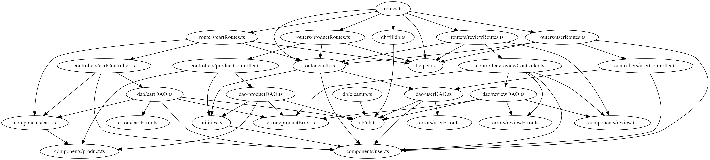
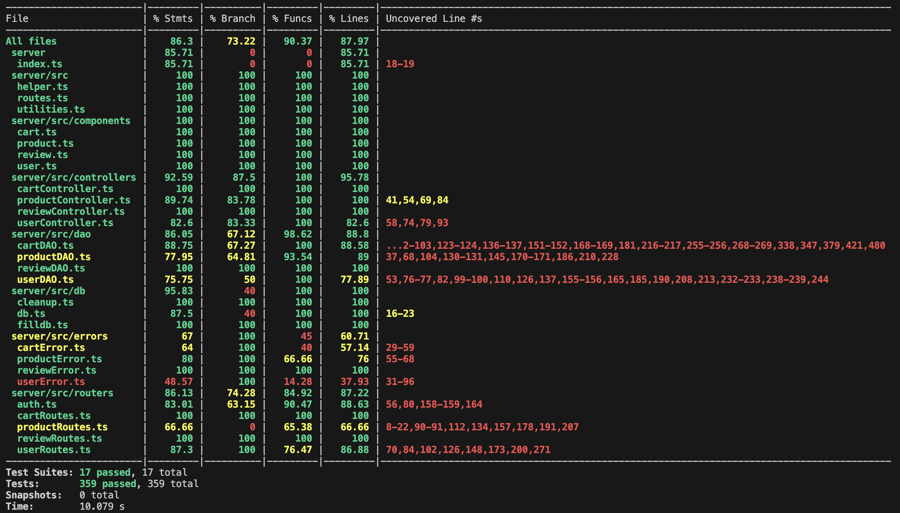

# Test Report

<The goal of this document is to explain how the application was tested, detailing how the test cases were defined and what they cover>

# Contents

- [Test Report](#test-report)
- [Contents](#contents)
- [Dependency graph](#dependency-graph)
- [Integration approach](#integration-approach)
- [Tests](#tests)
- [Coverage](#coverage)
  - [Coverage of FR](#coverage-of-fr)
  - [Coverage white box](#coverage-white-box)

# Dependency graph

# Integration approach

    <Write here the integration sequence you adopted, in general terms (top down, bottom up, mixed) and as sequence

    (ex: step1: unit A, step 2: unit A+B, step 3: unit A+B+C, etc)>
The integration sequence adopted is mixed:
- Top down approach for testing the login (FR1.1), logout (FR1.2), create new user (FR.1.3)
- Bottom up approach for all the other functions

    <!-- <Some steps may  correspond to unit testing (ex step1 in ex above)> -->

    <!-- <One step will  correspond to API testing, or testing unit route.js> -->

# Tests

<in the table below list the test cases defined For each test report the object tested, the test level (API, integration, unit) and the technique used to define the test case (BB/ eq partitioning, BB/ boundary, WB/ statement coverage, etc)> <split the table if needed>

|                                          Test case name                                          |                 Object(s) tested                 | Test level  |              Technique used               |
| :----------------------------------------------------------------------------------------------: | :----------------------------------------------: | :---------: | :---------------------------------------: |
|                  Adding product to empty cart with authenticated user - Success                  |                  CartController                  |    Unit     |           WB/Statement coverage           |
|                                    Removing Product from Cart                                    |                  CartController                  |    Unit     |           WB/Statement coverage           |
|                                 Removing all Products from Cart                                  |                  CartController                  |    Unit     |           WB/Statement coverage           |
|                                    Retrieve Cart with element                                    |                  CartController                  |    Unit     |           WB/Statement coverage           |
|                                  Retrieve Cart with no element                                   |                  CartController                  |    Unit     |           WB/Statement coverage           |
|                                          Checkout Cart                                           |                  CartController                  |    Unit     |           WB/Statement coverage           |
|                                        Retrieve all Carts                                        |                  CartController                  |    Unit     |           WB/Statement coverage           |
|                               Retrieve all Carts of a single User                                |                  CartController                  |    Unit     |           WB/Statement coverage           |
|                                         Delete all carts                                         |                  CartController                  |    Unit     |           WB/Statement coverage           |
|                               Registering a new Product - SUCCESS                                |                ProductController                 |    Unit     |           WB/Statement coverage           |
|                              Registering a new Product - DateError                               |                ProductController                 |    Unit     |           WB/Statement coverage           |
|                                Change product quantity - SUCCESS                                 |                ProductController                 |    Unit     |           WB/Statement coverage           |
|                               Change product quantity - DateError                                |                ProductController                 |    Unit     |           WB/Statement coverage           |
|                                      Sell product - SUCCESS                                      |                ProductController                 |    Unit     |           WB/Statement coverage           |
|                                     Sell product - DateError                                     |                ProductController                 |    Unit     |           WB/Statement coverage           |
|                                      Get products - SUCCESS                                      |                ProductController                 |    Unit     |           WB/Statement coverage           |
|                                 Get available products - SUCCESS                                 |                ProductController                 |    Unit     |           WB/Statement coverage           |
|                                  Delete all products - SUCCESS                                   |                ProductController                 |    Unit     |           WB/Statement coverage           |
|                                Delete a single product - SUCCESS                                 |                ProductController                 |    Unit     |           WB/Statement coverage           |
|                                       addReview - success                                        |                 ReviewController                 |    Unit     |           WB/Statement coverage           |
|                          addReview should handle NoExistingReviewError                           |                 ReviewController                 |    Unit     |           WB/Statement coverage           |
|                             addReview - failure with invalid rating                              |                 ReviewController                 |    Unit     |           WB/Statement coverage           |
|                                   addReview - boundary ratings                                   |                 ReviewController                 |    Unit     |           WB/Statement coverage           |
|                           addReview should handle ProductNotFoundError                           |                 ReviewController                 |    Unit     |           WB/Statement coverage           |
|                addReview should throw 'internal server error' for generic errors                 |                 ReviewController                 |    Unit     |           WB/Statement coverage           |
|                                getProductReviews - retrieves data                                |                 ReviewController                 |    Unit     |           WB/Statement coverage           |
|                 getProductReviews - no reviews found throws NoReviewProductError                 |                 ReviewController                 |    Unit     |           WB/Statement coverage           |
|                               getProductReviews - multiple reviews                               |                 ReviewController                 |    Unit     |           WB/Statement coverage           |
|                                      deleteReview - success                                      |                 ReviewController                 |    Unit     |           WB/Statement coverage           |
|                            deleteReview - throws NoReviewProductError                            |                 ReviewController                 |    Unit     |           WB/Statement coverage           |
|                            deleteReview - throws ProductNotFoundError                            |                 ReviewController                 |    Unit     |           WB/Statement coverage           |
|                   deleteReview - throws generic error as internal server error                   |                 ReviewController                 |    Unit     |           WB/Statement coverage           |
|                                 deleteReviewsOfProduct - success                                 |                 ReviewController                 |    Unit     |           WB/Statement coverage           |
|                          deleteReviewsOfProduct - no reviews to delete                           |                 ReviewController                 |    Unit     |           WB/Statement coverage           |
|                         deleteReviewsOfProduct - product not found error                         |                 ReviewController                 |    Unit     |           WB/Statement coverage           |
|          deleteReviewsOfProduct should throw 'internal server error' for generic errors          |                 ReviewController                 |    Unit     |           WB/Statement coverage           |
|                                    deleteAllReviews - success                                    |                 ReviewController                 |    Unit     |           WB/Statement coverage           |
|                            deleteAllReviews - throws error on failure                            |                 ReviewController                 |    Unit     |           WB/Statement coverage           |
|                                      It should return true                                       |            UserController.createUser             |    Unit     |           WB/Statement coverage           |
|                             getUsers resolves with an array of users                             |             UserController.getUsers              |    Unit     |           WB/Statement coverage           |
|               getUsersByRole resolves with an array of users of the specified role               |          UserController.getUsersByRole           |    Unit     |           WB/Statement coverage           |
|                          getUserByUsername resolves with a user object                           |         UserController.getUserByUsername         |    Unit     |           WB/Statement coverage           |
|                                  deleteUser should return true                                   |            UserController.deleteUser             |    Unit     |           WB/Statement coverage           |
|                                   deleteAll should return true                                   |             UserController.deleteAll             |    Unit     |           WB/Statement coverage           |
|                      updateUserInfo should return the new info of the user                       |          UserController.updateUserInfo           |    Unit     |           WB/Statement coverage           |
|                                  Correct with non existing Cart                                  |                     CartDAO                      |    Unit     |           WB/Statement coverage           |
|                          Correct with existing Cart with only a product                          |                     CartDAO                      |    Unit     |           WB/Statement coverage           |
|                            addProductToCart - Product does not exist                             |                     CartDAO                      |    Unit     |           WB/Statement coverage           |
|                              addProductToCart - Product is sold out                              |                     CartDAO                      |    Unit     |           WB/Statement coverage           |
|                            addProductToCart - Product exists in cart                             |                     CartDAO                      |    Unit     |           WB/Statement coverage           |
|                                      updateCartCost success                                      |                     CartDAO                      |    Unit     |           WB/Statement coverage           |
|           should return the cart with products if an unpaid cart is found for the user           |                     CartDAO                      |    Unit     |           WB/Statement coverage           |
|          should return an empty cart if no unpaid cart is found for the user           |                     CartDAO                      |    Unit     |           WB/Statement coverage           |
|           should throw CartNotFoundError if an error occurs while fetching products           |                     CartDAO                      |    Unit     |           WB/Statement coverage           |
|           should throw EmptyCartError if cart is empty- Checkout Cart       |                     CartDAO                      |    Unit     |           WB/Statement coverage           |
|           should throw ProductNotFoundError if product is not found in stock - Checkout Cart          |                     CartDAO                      |    Unit     |           WB/Statement coverage           |
|           should throw ProductSoldError if product quantity in cart exceeds stock - Checkout Cart           |                     CartDAO                      |    Unit     |           WB/Statement coverage           |
|           should mark the cart as paid and update product quantities - Checkout Cart            |                     CartDAO                      |    Unit     |           WB/Statement coverage           |
|           should return an empty array if no paid carts are found - Retrieve Carts           |                     CartDAO                      |    Unit     |           WB/Statement coverage           |
|           should return carts with their products if paid carts are found - Retrieve Carts           |                     CartDAO                      |    Unit     |           WB/Statement coverage           |
|           should throw CartNotFoundError if there is an error fetching carts - Retrieve Carts           |                     CartDAO                      |    Unit     |           WB/Statement coverage           |
|           should throw ProductNotFoundError if there is an error fetching products - Retrieve Carts           |                     CartDAO                      |    Unit     |           WB/Statement coverage           |
|           should return true when all carts and products are deleted successfully - DeleteAllCarts           |                     CartDAO                      |    Unit     |           WB/Statement coverage           |
|           should return false when there is an error deleting products - DeleteAllCarts           |                     CartDAO                      |    Unit     |           WB/Statement coverage           |
|           should return false when there is an error deleting carts - DeleteAllCarts           |                     CartDAO                      |    Unit     |           WB/Statement coverage           |
|           should return an empty array if no carts are found - GetAllCarts           |                     CartDAO                      |    Unit     |           WB/Statement coverage           |
|           should return carts with their products if carts are found - GetAllCarts           |                     CartDAO                      |    Unit     |           WB/Statement coverage           |
|           should throw an error if there is an issue fetching carts - GetAllCarts           |                     CartDAO                      |    Unit     |           WB/Statement coverage           |
|           should throw an error if there is an issue fetching products for a cart - GetAllCarts           |                     CartDAO                      |    Unit     |           WB/Statement coverage           |
|           It should remove the product from the cart - RemoveFromCart           |                     CartDAO                      |    Unit     |           WB/Statement coverage           |

|           It should return false if the product is not found - RemoveFromCart           |                     CartDAO                      |    Unit     |           WB/Statement coverage           |

|          It should remove all products from the cart  - RemoveAllFromCart           |                     CartDAO                      |    Unit     |           WB/Statement coverage           |
|           It should return false if no cart is connected with the user - RemoveAllFromCart           |                     CartDAO                      |    Unit     |           WB/Statement coverage           |
|                                 Register new Products - SUCCESS                                  |                    ProductDAO                    |    Unit     |           WB/Statement coverage           |
|                        Register new Products - ProductAlreadyExistsError                         |                    ProductDAO                    |    Unit     |           WB/Statement coverage           |
|                                Change product quantity - SUCCESS                                 |                    ProductDAO                    |    Unit     |           WB/Statement coverage           |
|                          Change product quantity - ProductNotFoundError                          |                    ProductDAO                    |    Unit     |           WB/Statement coverage           |
|                               Change product quantity - DateError                                |                    ProductDAO                    |    Unit     |           WB/Statement coverage           |
|                                      Sell product - SUCCESS                                      |                    ProductDAO                    |    Unit     |           WB/Statement coverage           |
|                               Sell product - ProductNotFoundError                                |                    ProductDAO                    |    Unit     |           WB/Statement coverage           |
|                                     Sell product - DateError                                     |                    ProductDAO                    |    Unit     |           WB/Statement coverage           |
|                                 Sell product - ProductSoldError                                  |                    ProductDAO                    |    Unit     |           WB/Statement coverage           |
|                                      Get products - SUCCESS                                      |                    ProductDAO                    |    Unit     |           WB/Statement coverage           |
|                                 Get available products - SUCCESS                                 |                    ProductDAO                    |    Unit     |           WB/Statement coverage           |
|                                  Delete all products - SUCCESS                                   |                    ProductDAO                    |    Unit     |           WB/Statement coverage           |
|                                     Delete product - SUCCESS                                     |                    ProductDAO                    |    Unit     |           WB/Statement coverage           |
|                              Delete product - ProductNotFoundError                               |                    ProductDAO                    |    Unit     |           WB/Statement coverage           |
|                            addReview should successfully add a review                            |                    ReviewDAO                     |    Unit     |           WB/Statement coverage           |
|                           addReview should throw ProductNotFoundError                            |                    ReviewDAO                     |    Unit     |           WB/Statement coverage           |
|                            addReview should throw ExistingReviewError                            |                    ReviewDAO                     |    Unit     |           WB/Statement coverage           |
|                        addReview should handle database errors on insert                         |                    ReviewDAO                     |    Unit     |           WB/Statement coverage           |
|                            getProductReviews should retrieve reviews                             |                    ReviewDAO                     |    Unit     |           WB/Statement coverage           |
|                         getProductReviews should handle database errors                          |                    ReviewDAO                     |    Unit     |           WB/Statement coverage           |
|                         deleteReview should successfully delete a review                         |                    ReviewDAO                     |    Unit     |           WB/Statement coverage           |
|                          deleteReview should throw NoReviewProductError                          |                    ReviewDAO                     |    Unit     |           WB/Statement coverage           |
|                            deleteReview should handle database errors                            |                    ReviewDAO                     |    Unit     |           WB/Statement coverage           |
|                         deleteReviewsOfProduct should delete all reviews                         |                    ReviewDAO                     |    Unit     |           WB/Statement coverage           |
|                            deleteAllReviews should delete all reviews                            |                    ReviewDAO                     |    Unit     |           WB/Statement coverage           |
|                         getIsUserAuthenticated with correct credentials                          |          UserDAO.getIsUserAuthenticated          |    Unit     |           WB/Statement coverage           |
|                            getIsUserAuthenticated with wrong username                            |          UserDAO.getIsUserAuthenticated          |    Unit     |           WB/Statement coverage           |
|                                  createUser should resolve true                                  |                UserDAO.createUser                |    Unit     |           WB/Statement coverage           |
|                          getUserByUsername should resolve the user row                           |            UserDAO.getUserByUsername             |    Unit     |           WB/Statement coverage           |
|                        getUserByUsername should resolve UserNotFoundError                        |            UserDAO.getUserByUsername             |    Unit     |           WB/Statement coverage           |
|                              getUsers should resolve the user rows                               |                 UserDAO.getUsers                 |    Unit     |           WB/Statement coverage           |
|                            getUsers should resolve UserNotFoundError                             |                 UserDAO.getUsers                 |    Unit     |           WB/Statement coverage           |
|                           getUsersByRole should resolve the user rows                            |              UserDAO.getUsersByRole              |    Unit     |           WB/Statement coverage           |
|                          getUsersByRole should throw UserNotFoundError                           |              UserDAO.getUsersByRole              |    Unit     |           WB/Statement coverage           |
|                                  deleteUser should resolve true                                  |                UserDAO.deleteUser                |    Unit     |           WB/Statement coverage           |
|                                  deleteAll should resolve true                                   |                UserDAO.deleteAll                 |    Unit     |           WB/Statement coverage           |
|                        updateUserInfo should resolve the updated user row                        |              UserDAO.updateUserInfo              |    Unit     |           WB/Statement coverage           |
|                                updateUserRole should resolve true                                |                UserDAO.createUser                |    Unit     |           WB/Statement coverage           |
|                          updateUserRole should throw UserNotFoundError                           |                 UserDAO.getUsers                 |    Unit     |           WB/Statement coverage           |
|                           It should return a 200 code with empty Cart                            |                    CartRoutes                    |    Unit     |           WB/Statement coverage           |
|                            It should return a 200 code with full Cart                            |                    CartRoutes                    |    Unit     |           WB/Statement coverage           |
|                   It should return a 401 code if user not logged in (Get cart)                   |                    CartRoutes                    |    Unit     |           WB/Statement coverage           |
|               It should return a 401 code if the user is not a customer (Get cart)               |                    CartRoutes                    |    Unit     |           WB/Statement coverage           |
|          It should return a 503 code if there is an error in the controller (Get cart)           |                    CartRoutes                    |    Unit     |           WB/Statement coverage           |
|                       It should return a 200 code for successful checkout                        |                    CartRoutes                    |    Unit     |           WB/Statement coverage           |
|                It should return a 401 code if user not logged in (Checkout cart)                 |                    CartRoutes                    |    Unit     |           WB/Statement coverage           |
|            It should return a 401 code if the user is not a customer (Checkout cart)             |                    CartRoutes                    |    Unit     |           WB/Statement coverage           |
|        It should return a 404 code if there is an error in the controller (Checkout cart)        |                    CartRoutes                    |    Unit     |           WB/Statement coverage           |
|                        It should return a 200 code with the cart history                         |                    CartRoutes                    |    Unit     |           WB/Statement coverage           |
|               It should return a 401 code if user not logged in (Get cart history)               |                    CartRoutes                    |    Unit     |           WB/Statement coverage           |
|           It should return a 401 code if the user is not a customer (Get cart history)           |                    CartRoutes                    |    Unit     |           WB/Statement coverage           |
|      It should return a 503 code if there is an error in the controller (Get cart history)       |                    CartRoutes                    |    Unit     |           WB/Statement coverage           |
|               It should return a 200 code if the product was removed from the cart               |                    CartRoutes                    |    Unit     |           WB/Statement coverage           |
|                  It should return a 404 code if the model parameter is missing                   |                    CartRoutes                    |    Unit     |           WB/Statement coverage           |
|                It should return a 401 code if user not logged in (Remove product)                |                    CartRoutes                    |    Unit     |           WB/Statement coverage           |
|            It should return a 401 code if the user is not a customer (Remove product)            |                    CartRoutes                    |    Unit     |           WB/Statement coverage           |
|       It should return a 503 code if there is an error in the controller (Remove product)        |                    CartRoutes                    |    Unit     |           WB/Statement coverage           |
|                 It should return a 200 code if the cart was cleared successfully                 |                    CartRoutes                    |    Unit     |           WB/Statement coverage           |
|                  It should return a 401 code if user not logged in (Clear cart)                  |                    CartRoutes                    |    Unit     |           WB/Statement coverage           |
|              It should return a 401 code if the user is not a customer (Clear cart)              |                    CartRoutes                    |    Unit     |           WB/Statement coverage           |
|         It should return a 503 code if there is an error in the controller (Clear cart)          |                    CartRoutes                    |    Unit     |           WB/Statement coverage           |
|                It should return a 200 code if all carts were deleted successfully                |                    CartRoutes                    |    Unit     |           WB/Statement coverage           |
|               It should return a 401 code if user not logged in (Delete all carts)               |                    CartRoutes                    |    Unit     |           WB/Statement coverage           |
|      It should return a 401 code if the user is not an admin or manager (Delete all carts)       |                    CartRoutes                    |    Unit     |           WB/Statement coverage           |
|      It should return a 503 code if there is an error in the controller (Delete all carts)       |                    CartRoutes                    |    Unit     |           WB/Statement coverage           |
|                            It should return a 200 code with all carts                            |                    CartRoutes                    |    Unit     |           WB/Statement coverage           |
|                It should return a 401 code if user not logged in (Get all carts)                 |                    CartRoutes                    |    Unit     |           WB/Statement coverage           |
|        It should return a 401 code if the user is not an admin or manager (Get all carts)        |                    CartRoutes                    |    Unit     |           WB/Statement coverage           |
|        It should return a 503 code if there is an error in the controller (Get all carts)        |                    CartRoutes                    |    Unit     |           WB/Statement coverage           |
|                 It should return a 200 code if the product was added to the cart                 |                    CartRoutes                    |    Unit     |           WB/Statement coverage           |
|                       It should return a 400 code if the model is missing                        |                    CartRoutes                    |    Unit     |           WB/Statement coverage           |
|                   It should return a 400 code if the model is an empty string                    |                    CartRoutes                    |    Unit     |           WB/Statement coverage           |
|                 It should return a 401 code if user not logged in (Add product)                  |                    CartRoutes                    |    Unit     |           WB/Statement coverage           |
|             It should return a 401 code if the user is not a customer (Add product)              |                    CartRoutes                    |    Unit     |           WB/Statement coverage           |
|         It should return a 503 code if there is an error in the controller (Add product)         |                    CartRoutes                    |    Unit     |           WB/Statement coverage           |
|                           200 Code with correct informations and auth                            |                  ProductRoutes                   |    Unit     |           WB/Statement coverage           |
|                            200 Code with null details and arrivalDate                            |                  ProductRoutes                   |    Unit     |           WB/Statement coverage           |
|                                  422 Code with not string model                                  |                  ProductRoutes                   |    Unit     |           WB/Statement coverage           |
|                                    422 Code with empty model                                     |                  ProductRoutes                   |    Unit     |           WB/Statement coverage           |
|                                422 Code with not string category                                 |                  ProductRoutes                   |    Unit     |           WB/Statement coverage           |
|                         422 Code with empty category / category invalid                          |                  ProductRoutes                   |    Unit     |           WB/Statement coverage           |
|                                  422 Code with not int quantity                                  |                  ProductRoutes                   |    Unit     |           WB/Statement coverage           |
|                                   422 Code with zero quantity                                    |                  ProductRoutes                   |    Unit     |           WB/Statement coverage           |
|                                 422 Code with not string details                                 |                  ProductRoutes                   |    Unit     |           WB/Statement coverage           |
|                                 422 Code with zero sellingPrice                                  |                  ProductRoutes                   |    Unit     |           WB/Statement coverage           |
|                               422 Code with not string arrivalDate                               |                  ProductRoutes                   |    Unit     |           WB/Statement coverage           |
|                              422 Code with wrong format arrivalDate                              |                  ProductRoutes                   |    Unit     |           WB/Statement coverage           |
|                                401 Code with unauthenticated user                                |                  ProductRoutes                   |    Unit     |           WB/Statement coverage           |
|                             401 Code with not Admin nor Manager user                             |                  ProductRoutes                   |    Unit     |           WB/Statement coverage           |
|                           200 Code with correct informations and auth                            |                  ProductRoutes                   |    Unit     |           WB/Statement coverage           |
|                                  200 Code with null changeDate                                   |                  ProductRoutes                   |    Unit     |           WB/Statement coverage           |
|                                  422 Code with not int quantity                                  |                  ProductRoutes                   |    Unit     |           WB/Statement coverage           |
|                                   422 Code with zero quantity                                    |                  ProductRoutes                   |    Unit     |           WB/Statement coverage           |
|                                 422 Code wrong format changeDate                                 |                  ProductRoutes                   |    Unit     |           WB/Statement coverage           |
|                                401 Code with unauthenticated user                                |                  ProductRoutes                   |    Unit     |           WB/Statement coverage           |
|                             401 Code with not Admin nor Manager user                             |                  ProductRoutes                   |    Unit     |           WB/Statement coverage           |
|                           200 Code with correct informations and auth                            |                  ProductRoutes                   |    Unit     |           WB/Statement coverage           |
|                                  200 Code with null sellingDate                                  |                  ProductRoutes                   |    Unit     |           WB/Statement coverage           |
|                              422 Code with wrong format sellingDate                              |                  ProductRoutes                   |    Unit     |           WB/Statement coverage           |
|                                  422 Code with not int quantity                                  |                  ProductRoutes                   |    Unit     |           WB/Statement coverage           |
|                                   422 Code with zero quantity                                    |                  ProductRoutes                   |    Unit     |           WB/Statement coverage           |
|                                401 Code with unauthenticated user                                |                  ProductRoutes                   |    Unit     |           WB/Statement coverage           |
|                             401 Code with not Admin nor Manager user                             |                  ProductRoutes                   |    Unit     |           WB/Statement coverage           |
|                             200 Code with all query parameters null                              |                  ProductRoutes                   |    Unit     |           WB/Statement coverage           |
|                                200 Code with grouping as category                                |                  ProductRoutes                   |    Unit     |           WB/Statement coverage           |
|                                 200 Code with grouping as model                                  |                  ProductRoutes                   |    Unit     |           WB/Statement coverage           |
|                       422 Code with grouping as category and category null                       |                  ProductRoutes                   |    Unit     |           WB/Statement coverage           |
|                               It should add a review successfully                                |                   ReviewRoutes                   |    Unit     |           WB/Statement coverage           |
|                        It should handle errors when adding a review fails                        |                   ReviewRoutes                   |    Unit     |           WB/Statement coverage           |
|                     It should retrieve all reviews of a product successfully                     |                   ReviewRoutes                   |    Unit     |           WB/Statement coverage           |
|                      It should handle errors when retrieving reviews fails                       |                   ReviewRoutes                   |    Unit     |           WB/Statement coverage           |
|                              It should delete a review successfully                              |                   ReviewRoutes                   |    Unit     |           WB/Statement coverage           |
|                       It should handle errors when deleting a review fails                       |                   ReviewRoutes                   |    Unit     |           WB/Statement coverage           |
|                      It should delete all reviews of a product successfully                      |                   ReviewRoutes                   |    Unit     |           WB/Statement coverage           |
|                     It should handle errors when deleting all reviews fails                      |                   ReviewRoutes                   |    Unit     |           WB/Statement coverage           |
|                         should delete all reviews and return status 200                          |                   ReviewRoutes                   |    Unit     |           WB/Statement coverage           |
|                     It should handle errors when deleting all reviews fails                      |                   ReviewRoutes                   |    Unit     |           WB/Statement coverage           |
|                        It should return a 200 code when a user is created                        |       UserRoutes POST ezelectronics/users        |    Unit     |           WB/Statement coverage           |
|                  It should return a 422 code if the body is not well-formatted                   |       UserRoutes POST ezelectronics/users        |    Unit     |           WB/Statement coverage           |
|                                   It should return a 200 code                                    |        UserRoutes GET ezelectronics/users        |    Unit     |           WB/Statement coverage           |
|                     It should return a 401 code if the user is not logged in                     |        UserRoutes GET ezelectronics/users        |    Unit     |           WB/Statement coverage           |
|                     It should return a 401 code if the user is not an admin                      |        UserRoutes GET ezelectronics/users        |    Unit     |           WB/Statement coverage           |
|                                   It should return a 200 code                                    |  UserRoutes GET ezelectronics/users/roles/:role  |    Unit     |           WB/Statement coverage           |
|                      It should return a 422 code if the role does not exist                      |  UserRoutes GET ezelectronics/users/roles/:role  |    Unit     |           WB/Statement coverage           |
|                     It should return a 401 code if the user is not an admin                      |  UserRoutes GET ezelectronics/users/roles/:role  |    Unit     |           WB/Statement coverage           |
|                     It should return a 401 code if the user is not logged in                     |  UserRoutes GET ezelectronics/users/roles/:role  |    Unit     |           WB/Statement coverage           |
|                                   It should return a 200 code                                    |   UserRoutes GET ezelectronics/users/:username   |    Unit     |           WB/Statement coverage           |
|                     It should return a 401 code if the user is not logged in                     |   UserRoutes GET ezelectronics/users/:username   |    Unit     |           WB/Statement coverage           |
|            It should return a 401 code if a non-admin user tries to get another user             |   UserRoutes GET ezelectronics/users/:username   |    Unit     |           WB/Statement coverage           |
|              It should return a 200 code if an admin user tries to get another user              |   UserRoutes GET ezelectronics/users/:username   |    Unit     |           WB/Statement coverage           |
|                     It should return a 200 code when the user is eliminated                      | UserRoutes DELETE ezelectronics/users/:username  |    Unit     |           WB/Statement coverage           |
|               It should return a 200 code when the user is eliminated by an admin                | UserRoutes DELETE ezelectronics/users/:username  |    Unit     |           WB/Statement coverage           |
|        It should return a 401 code when the user is eliminated by another non-admin user         | UserRoutes DELETE ezelectronics/users/:username  |    Unit     |           WB/Statement coverage           |
|               It should return a 200 code when all non-admin users are eliminated                |      UserRoutes DELETE ezelectronics/users       |    Unit     |           WB/Statement coverage           |
|                It should return a 401 code when a non-admin user tries to call it                |      UserRoutes DELETE ezelectronics/users       |    Unit     |           WB/Statement coverage           |
|           It should return a 200 code when an admin updates another user successfully            |  UserRoutes PATCH ezelectronics/users/:username  |    Unit     |           WB/Statement coverage           |
|                   It should return a 200 code when a user tries to edit itself                   |  UserRoutes PATCH ezelectronics/users/:username  |    Unit     |           WB/Statement coverage           |
|           It should return a 401 code when a non-admin user tries to edit another user           |  UserRoutes PATCH ezelectronics/users/:username  |    Unit     |           WB/Statement coverage           |
|              It should return a 422 code when the body is not respecting the format              |  UserRoutes PATCH ezelectronics/users/:username  |    Unit     |           WB/Statement coverage           |
|           It should return a 200 code when a user is logged in with valid credentials            |      UserRoutes POST ezelectronics/sessions      |    Unit     |           WB/Statement coverage           |
|              It should return a 422 code when the body of the request is not valid               |      UserRoutes POST ezelectronics/sessions      |    Unit     |           WB/Statement coverage           |
|                           It should return a 401 code in case of error                           |      UserRoutes POST ezelectronics/sessions      |    Unit     |           WB/Statement coverage           |
|                      It should return a 200 code when a user is logged out                       | UserRoutes DELETE ezelectronics/sessions/current |    Unit     |           WB/Statement coverage           |
|                   It should return a 200 code when retrieving a logged in user                   |  UserRoutes GET ezelectronics/sessions/current   |    Unit     |           WB/Statement coverage           |
|                                      addProduct, empty Cart                                      |                     CartDAO                      | Integration |           WB/Statement coverage           |
|                                    addProduct, existent Cart                                     |                     CartDAO                      | Integration |           WB/Statement coverage           |
|                                          Get Empty Cart                                          |                     CartDAO                      | Integration |           WB/Statement coverage           |
|                                        Get non-empty Cart                                        |                     CartDAO                      | Integration |           WB/Statement coverage           |
|                                       Checkout Empty Cart                                        |                     CartDAO                      | Integration |           WB/Statement coverage           |
|                              Checkout non-empty Cart with 1 element                              |                     CartDAO                      | Integration |           WB/Statement coverage           |
|                                          Multiple Carts                                          |                     CartDAO                      | Integration |           WB/Statement coverage           |
|                                            Empty Cart                                            |                     CartDAO                      | Integration |           WB/Statement coverage           |
|                                     Remove product from cart                                     |                     CartDAO                      | Integration |           WB/Statement coverage           |
|                                  Remove all products from cart                                   |                     CartDAO                      | Integration |           WB/Statement coverage           |
|                                         Delete all carts                                         |                     CartDAO                      | Integration |           WB/Statement coverage           |
|                                        Retrieve all carts                                        |                     CartDAO                      | Integration |           WB/Statement coverage           |
|                         Checkout Empty Cart should throw EmptyCartError                          |                     CartDAO                      | Integration |           WB/Exception coverage           |
|                Add non-existent product to cart should throw ProductNotFoundError                |                     CartDAO                      | Integration |           WB/Exception coverage           |
|             Retrieve Carts when no product in cart should throw ProductNotFoundError             |                     CartDAO                      | Integration |           WB/Exception coverage           |
|                                       Add product to cart                                        |      Cart + Routes + Controller + DAO + DB       | Integration |          BB/Functional coverage           |
|                                      Retrieve a cart                                      |      Cart + Routes + Controller + DAO + DB       | Integration |          BB/Functional coverage           |
|                        Checkout an empty cart should throw EmptyCartError                        |      Cart + Routes + Controller + DAO + DB       | Integration |           BB/Exception coverage           |
|                Add non-existent product to cart should throw ProductNotFoundError                |      Cart + Routes + Controller + DAO + DB       | Integration |           BB/Exception coverage           |
|                                     Remove product from cart                                     |      Cart + Routes + Controller + DAO + DB       | Integration |          BB/Functional coverage           |
|                                  Remove all products from cart                                   |      Cart + Routes + Controller + DAO + DB       | Integration |          BB/Functional coverage           |
|                                 Retrieve all carts of a customer                                 |      Cart + Routes + Controller + DAO + DB       | Integration |          BB/Functional coverage           |
|                                     Delete all carts (admin)                                     |      Cart + Routes + Controller + DAO + DB       | Integration |          BB/Functional coverage           |
|                                    Retrieve all carts of all users (admin)                                    |      Cart + Routes + Controller + DAO + DB       | Integration |          BB/Functional coverage           |
|                                    Delete all carts (manager)                                    |      Cart + Routes + Controller + DAO + DB       | Integration |          BB/Functional coverage           |
|                                   Retrieve all carts of all users (manager)                                   |      Cart + Routes + Controller + DAO + DB       | Integration |          BB/Functional coverage           |
|                            Register a set of new products - DB + DAO                             |                    ProductDAO                    | Integration |          BB/Functional coverage           |
|                      Register a set of new products - DB + DAO + Controller                      |                ProductController                 | Integration |          BB/Functional coverage           |
|                 Register a set of new products - DB + DAO + Controller + Routes                  |                  ProductRoutes                   | Integration |          BB/Functional coverage           |
|                           Update the quantity of a product - DB + DAO                            |                    ProductDAO                    | Integration |          BB/Functional coverage           |
|                     Update the quantity of a product - DB + DAO + Controller                     |                ProductController                 | Integration |          BB/Functional coverage           |
|                Update the quantity of a product - DB + DAO + Controller + Routes                 |                  ProductRoutes                   | Integration |          BB/Functional coverage           |
|                                    Sell a product - DB + DAO                                     |                    ProductDAO                    | Integration |          BB/Functional coverage           |
|                              Sell a product - DB + DAO + Controller                              |                ProductController                 | Integration |          BB/Functional coverage           |
|                         Sell a product - DB + DAO + Controller + Routes                          |                  ProductRoutes                   | Integration |          BB/Functional coverage           |
|                               Show the list of products - DB + DAO                               |                    ProductDAO                    | Integration | BB/Functional coverage/Statement coverage |
|                        Show the list of products - DB + DAO + Controller                         |                ProductController                 | Integration | BB/Functional coverage/Statement coverage |
|                    Show the list of products - DB + DAO + Controller + Routes                    |                  ProductRoutes                   | Integration | BB/Functional coverage/Statement coverage |
|                          Show the list of available products - DB + DAO                          |                    ProductDAO                    | Integration | BB/Functional coverage/Statement coverage |
|                   Show the list of available products - DB + DAO + Controller                    |                ProductController                 | Integration | BB/Functional coverage/Statement coverage |
|               Show the list of available products - DB + DAO + Controller + Routes               |                  ProductRoutes                   | Integration | BB/Functional coverage/Statement coverage |
|                                   Delete a product - DB + DAO                                    |                    ProductDAO                    | Integration | BB/Functional coverage/Statement coverage |
|                             Delete a product - DB + DAO + Controller                             |                ProductController                 | Integration | BB/Functional coverage/Statement coverage |
|                        Delete a product - DB + DAO + Controller + Routes                         |                  ProductRoutes                   | Integration | BB/Functional coverage/Statement coverage |
|                                  Delete all products - DB + DAO                                  |                    ProductDAO                    | Integration | BB/Functional coverage/Statement coverage |
|                           Delete all products - DB + DAO + Controller                            |                ProductController                 | Integration | BB/Functional coverage/Statement coverage |
|                       Delete all products - DB + DAO + Controller + Routes                       |                  ProductRoutes                   | Integration | BB/Functional coverage/Statement coverage |
|                                 should add a review to a product                                 |                      Review                      | Integration |          BB/Functional coverage           |
|                              should return 409 for duplicate review                              |                      Review                      | Integration |           BB/Exception coverage           |
|              should return 401 for unauthorized access (admin trying to add review)              |                      Review                      | Integration |           BB/Exception coverage           |
|                            should return 404 for non-existent product                            |                      Review                      | Integration |           BB/Exception coverage           |
|             should return 401 for unauthorized access (manager trying to add review)             |                      Review                      | Integration |           BB/Exception coverage           |
|                               should return 422 for invalid score                                |                      Review                      | Integration |           BB/Exception coverage           |
|                               should return 422 for empty comment                                |                      Review                      | Integration |           BB/Exception coverage           |
|                               should return 422 for missing score                                |                      Review                      | Integration |           BB/Exception coverage           |
|                              should return 422 for missing comment                               |                      Review                      | Integration |           BB/Exception coverage           |
|                             should return all reviews for a product                              |                      Review                      | Integration |          BB/Functional coverage           |
|                      should return an empty array for non-existent product                       |                      Review                      | Integration |          BB/Functional coverage           |
|                           should return 401 for unauthenticated access                           |                      Review                      | Integration |           BB/Exception coverage           |
|                        should delete the review made by the current user                         |                      Review                      | Integration |          BB/Functional coverage           |
|                     should return 404 if the review to delete does not exist                     |                      Review                      | Integration |           BB/Exception coverage           |
|            should return 404 if trying to delete a review for a non-existent product             |                      Review                      | Integration |           BB/Exception coverage           |
|           should return 401 for unauthorized access when attempting to delete a review           |                      Review                      | Integration |           BB/Exception coverage           |
|                    should delete all reviews for a specific product by Admin                     |                      Review                      | Integration |          BB/Functional coverage           |
|                   should delete all reviews for a specific product by Manager                    |                      Review                      | Integration |          BB/Functional coverage           |
|             should return 404 if trying to delete reviews for a non-existent product             |                      Review                      | Integration |           BB/Exception coverage           |
|                     should return 401 for unauthorized access by a Customer                      |                      Review                      | Integration |           BB/Exception coverage           |
|                              should delete all reviews by an Admin                               |                      Review                      | Integration |          BB/Functional coverage           |
|                              should delete all reviews by a Manager                              |                      Review                      | Integration |          BB/Functional coverage           |
|                     should return 401 for unauthorized access by a Customer                      |                      Review                      | Integration |           BB/Exception coverage           |
|                        Successfull login: It should resolve with code 200                        |                       User                       | Integration |          BB/Functional coverage           |
|                                 It should resolve with code 200                                  |                       User                       | Integration |          BB/Functional coverage           |
|                        Adding an user in the DB interacting with UserDAO                         |                       User                       | Integration |          BB/Functional coverage           |
|                Adding an user in the DB interacting with UserDAO + userController                |                       User                       | Integration |          BB/Functional coverage           |
|        Final: adding an user in the DB interacting with UserDAO + userController + Routes        |                       User                       | Integration |          BB/Functional coverage           |
|                       Final: It should return a 422 error code: wrong role                       |                       User                       | Integration |           BB/Exception coverage           |
|                      Final: It should return a 422 error code: no username                       |                       User                       | Integration |           BB/Exception coverage           |
|                        Final: It should return a 422 error code: no name                         |                       User                       | Integration |           BB/Exception coverage           |
|                        Final: should return a 422 error code: no surname                         |                       User                       | Integration |           BB/Exception coverage           |
|                      Final: It should return a 422 error code: no password                       |                       User                       | Integration |           BB/Exception coverage           |
|                   Retrieve all users saved on the DB: interacting with UserDAO                   |                       User                       | Integration |          BB/Functional coverage           |
|          Retrieve all users saved on the DB: interacting with UserDAO + userController           |                       User                       | Integration |          BB/Functional coverage           |
|   Final: Retrieve all users saved on the DB interacting with UserDAO + userController + Routes   |                       User                       | Integration |          BB/Functional coverage           |
|                 Retrieve users by role saved on the DB: interacting with UserDAO                 |                       User                       | Integration |          BB/Functional coverage           |
|        Retrieve users by role saved on the DB: interacting with UserDAO + userController         |                       User                       | Integration |          BB/Functional coverage           |
| Final: Retrieve users by role saved on the DB interacting with UserDAO + userController + Routes |                       User                       | Integration |          BB/Functional coverage           |
|                           Retrieve user info: interacting with UserDAO                           |                       User                       | Integration |          BB/Functional coverage           |
|                  Retrieve user info: interacting with UserDAO + userController                   |                       User                       | Integration |          BB/Functional coverage           |
|           Final: Retrieve user info interacting with UserDAO + userController + Routes           |                       User                       | Integration |          BB/Functional coverage           |
|                            Update user info: interacting with UserDAO                            |                       User                       | Integration |          BB/Functional coverage           |
|                   Update user info: interacting with UserDAO + userController                    |                       User                       | Integration |          BB/Functional coverage           |
|            Final: Update user info interacting with UserDAO + userController + Routes            |                       User                       | Integration |          BB/Functional coverage           |
|                        Delete a non-admin user: interacting with UserDAO                         |                       User                       | Integration |          BB/Functional coverage           |
|                Delete a non-admin user: interacting with UserDAO + userController                |                       User                       | Integration |          BB/Functional coverage           |
|             Final: Delete a user interacting with UserDAO + UserController + Routes              |                       User                       | Integration |          BB/Functional coverage           |
|                       Delete all non-admin users: interacting with UserDAO                       |                       User                       | Integration |          BB/Functional coverage           |
|              Delete all non-admin users: interacting with UserDAO + userController               |                       User                       | Integration |          BB/Functional coverage           |
|       Final: Delete all non-admin users interacting with UserDAO + UserController + Routes       |                       User                       | Integration |          BB/Functional coverage           |

# Coverage

## Coverage of FR

<Report in the following table the coverage of functional requirements and scenarios(from official requirements) >

| Functional Requirement or scenario |                    Test(s)                    |
| :--------------------------------: | :-------------------------------------------: |
|               FR1.1                |                  Login FR1.1                  |
|               FR1.2                |                 Logout FR1.2                  |
|               FR1.3                |          Add a user to the DB FR1.3           |
|               FR2.1                |           Show list of users FR2.1            |
|               FR2.2                |       Show list of users by role FR2.2        |
|               FR2.3                |               Show a user FR2.3               |
|               FR2.4                |              Update a user FR2.4              |
|               FR2.5                |        Delete non-admin account FR2.5         |
|               FR2.6                |      Delete all non-admin accounts FR2.6      |
|               FR3.1                |    Register a set of new products - FR3.1     |
|               FR3.2                |   Update the quantity of a product - FR3.2    |
|               FR3.3                |            Sell a product - FR3.3             |
|               FR3.4                | Show the list of products - FR3.4 / 3.5 / 3.6 |
|              FR3.4.1               | Show the list of available products - FR3.4.1 |
|               FR3.7                |           Delete a product - FR3.7            |
|               FR3.8                |          Delete all products - FR3.8          |
|               FR4.1                |             Adding a review FR4.1             |
|               FR4.2                |           Retrieving reviews FR4.2            |
|               FR4.3                |            Deleting a review FR4.3            |
|               FR4.4                |     Delete all reviews of a product FR4.4     |
|               FR4.5                |   Delete all reviews of all products FR4.5    |
|               FR5.1                |                Retrieve a cart                |
|               FR5.2                |             Add a product to cart             |
|               FR5.3                |           Checkout the current cart           |
|               FR5.4                |       Retrieve all carts of a customer        |
|               FR5.5                |           Remove product from cart            |
|               FR5.6                |            Delete the current cart            |
|               FR5.7                |        Retrieve all carts of all users        |
|               FR5.8                |               Delete all carts                |

## Coverage white box

<!-- Report here the screenshot of coverage values obtained with jest-- coverage -->
  
